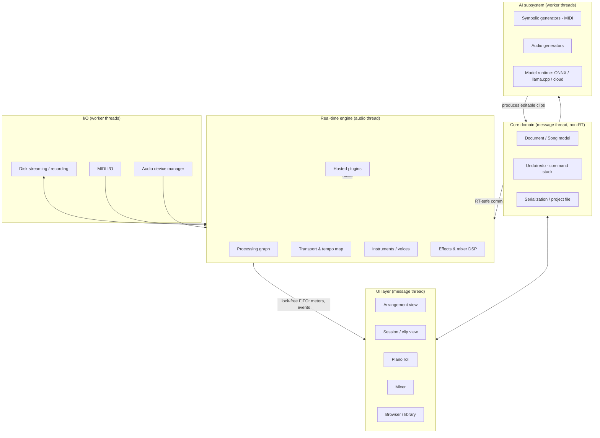
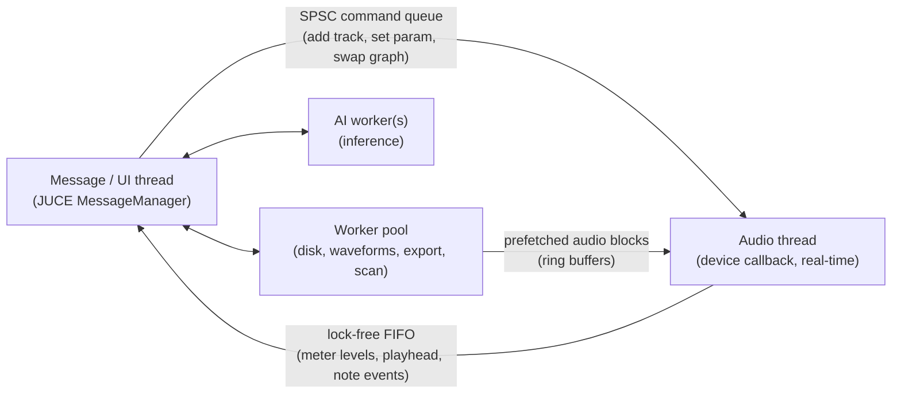
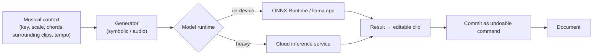

# Looper-Audio — Build Plan

A cross-platform **Digital Audio Workstation (DAW)** in C++ for arranging and generating
music, in the spirit of FL Studio, Ableton Live, and Reason — with a **generative / AI-assist
layer** as its defining feature.

> **Direction chosen:** serious, shippable product · JUCE foundation · hybrid DAW + AI assist ·
> cross-platform (macOS, Windows, Linux) · multi-year phased roadmap.

This is a living document. As sections mature they should graduate into their own files
(`ARCHITECTURE.md`, `ROADMAP.md`, `AI.md`), and this file becomes the index.

---

## Table of contents

1. [Product vision & positioning](#1-product-vision--positioning)
2. [Scope & non-goals](#2-scope--non-goals)
3. [Technology stack](#3-technology-stack)
4. [High-level architecture](#4-high-level-architecture)
5. [The real-time audio engine](#5-the-real-time-audio-engine-the-heart)
6. [Document & data model](#6-document--data-model)
7. [Plugin hosting](#7-plugin-hosting)
8. [The UI layer](#8-the-ui-layer)
9. [Built-in instruments & effects](#9-built-in-instruments--effects)
10. [The AI / generative subsystem](#10-the-ai--generative-subsystem-the-differentiator)
11. [Cross-platform & packaging](#11-cross-platform--packaging)
12. [Testing & QA strategy](#12-testing--qa-strategy)
13. [Proposed project structure](#13-proposed-project-structure)
14. [Phased roadmap](#14-phased-roadmap)
15. [Key risks & mitigations](#15-key-risks--mitigations)
16. [Immediate next steps](#16-immediate-next-steps)
17. [Appendix: reference reading](#17-appendix-reference-reading)

---

## 1. Product vision & positioning

**Looper-Audio** is a **loop-centric, AI-assisted DAW**. The name points at the identity: a
workflow built around clips and loops (like Ableton's Session View) rather than only a linear
tape timeline, with generative assistance that accelerates *ideation* while keeping every result
fully editable.

- **Who it's for:** producers who work loop-first — electronic, hip-hop, pop, lo-fi, scoring
  sketches — who want to move from idea to arrangement quickly.
- **The wedge (why it's different):** most DAWs treat AI as a bolt-on. Looper-Audio treats
  *generation* as a first-class citizen woven into the workflow: generate a melody in the current
  key/scale over the current chords, get four variations of a drum loop, extend a clip, fill
  harmony — all producing normal MIDI/audio clips you can edit by hand.
- **Guiding principles:**
  - **The human stays in control.** AI produces editable musical data, never an opaque black box in the signal path.
  - **Rock-solid real-time core.** Audio glitches are unforgivable; the engine's correctness and latency come before features.
  - **Loop-first, arrangement-ready.** Fast to jam, complete enough to finish a song.
  - **Cross-platform parity.** macOS and Windows first-class; Linux supported.

Competing feature-for-feature with 20-year-old incumbents is not the goal. Winning a *workflow*
(loop-centric + generative) is.

---

## 2. Scope & non-goals

**In scope (the product surface over the roadmap):**

- Multi-track audio + MIDI recording, editing, arranging
- Loop/clip launching (session view) **and** a linear arrangement timeline
- Piano roll, step sequencer, automation
- Mixer with routing, sends/returns, sidechaining
- Built-in instruments (synths, sampler, drums) and effects (EQ, dynamics, delay, reverb, …)
- Third-party plugin hosting: **VST3 + AU** first, **CLAP** later
- Generative/AI assistance: symbolic (MIDI) generation first, audio-domain generation later
- Offline render/export, stems, project save/load
- Signed, notarized installers per platform

**Non-goals (at least through 1.0):**

- Notation/score engraving (Sibelius/Dorico territory)
- Video editing (basic video-for-scoring reference at most, and only post-1.0)
- Hardware DSP / dedicated audio-interface driver development
- A cloud collaboration platform (interesting post-1.0, not core)
- Being a plugin *first* — Looper-Audio ships as an **application**; running the engine as a
  hostable plugin is a post-1.0 stretch goal.

---

## 3. Technology stack

| Concern | Choice | Notes |
|---|---|---|
| Language | **C++20** (consider C++23 where toolchains allow) | Concepts, `std::span`, `<atomic>` improvements, `constexpr` DSP tables. |
| App/audio framework | **JUCE 8** | Audio device I/O, MIDI, plugin hosting, GUI, cross-platform. Fastest credible path. |
| Build system | **CMake** (≥ 3.24) | Already implied by `.gitignore`. JUCE has first-class CMake support. |
| Dependencies | **vcpkg** (manifest mode) + **CPM.cmake** for JUCE | `.gitignore` already lists `vcpkg_installed/`. Pull JUCE via CPM or vcpkg. |
| Audio backends | CoreAudio (mac), WASAPI/ASIO (win), ALSA/JACK/PipeWire (linux) | All wrapped by JUCE's `AudioDeviceManager`. ASIO SDK has its own license. |
| Plugin formats hosted | VST3, AU (→ CLAP later) | VST3 SDK: GPLv3 or Steinberg proprietary agreement. AU is free on macOS. |
| DSP helpers | `juce::dsp`, plus targeted libs | Vectorized filters/FFT. Add specialist libs as needed (see below). |
| Time-stretch / pitch | **Rubber Band** or **SoundTouch** | Rubber Band is higher quality; check its dual GPL/commercial license. |
| Stem separation | **Demucs** (via ONNX/LibTorch) | Post-1.0 AI-adjacent feature. |
| ML inference (on-device) | **ONNX Runtime** (C++), and/or **llama.cpp/ggml** for transformer music-LMs | CPU + GPU execution providers; quantized models. |
| ML inference (cloud) | Pluggable service abstraction | For heavy audio-domain generation. Keep vendor-swappable. |
| Testing | **Catch2** or **GoogleTest**, plus **pluginval** | DSP unit tests, host/plugin validation. |
| CI | **GitHub Actions** matrix (mac/win/linux) | Build + test + artifact packaging. |
| Crash/telemetry | Sentry/Crashpad or Breakpad (opt-in) | Essential for a shipped desktop app. |

### Licensing budget (do not skip — this gates a commercial product)

- **JUCE (mid-2026):** dual-licensed **AGPLv3** *or* commercial. AGPL is unsuitable for a
  closed-source commercial DAW (network-copyleft), so plan on a commercial tier: **Personal**
  (free, under a revenue cap, adds a splash screen), **Indie ≈ $40/yr**, **Pro ≈ $800/yr**.
  *Verify current terms at [juce.com/get-juce](https://juce.com/get-juce/).*
- **VST3 SDK:** GPLv3 or a proprietary agreement with Steinberg.
- **ASIO SDK:** Steinberg license; can't be redistributed — users may use ASIO4ALL, or you sign the agreement.
- **AAX (Pro Tools):** Avid agreement + PACE signing — out of scope initially.
- **AI model weights:** licenses vary widely and **some forbid commercial use** (e.g., certain
  MusicGen weights are CC-BY-NC). Audit every model's license before shipping; prefer permissive/commercial-friendly weights.

---

## 4. High-level architecture

The single most important structural decision: **separate the real-time audio engine from the UI
and from the AI subsystem by hard boundaries.** They run on different threads and communicate only
through real-time-safe channels. Everything else follows from this.



**Layer responsibilities**

- **UI layer** — JUCE components. Renders state, captures intent. Never touches the audio thread directly.
- **Core domain** — the source of truth: the song/document model, undo/redo, serialization. Lives
  on the message thread; mutated only via commands.
- **Real-time engine** — the audio callback and everything it touches. Wait-free. Receives an
  immutable/RT-safe view of what to play; emits meters and events back.
- **AI subsystem** — off to the side. Consumes musical context, produces editable MIDI/audio that
  gets committed to the document like any user edit. **Never in the signal path.**
- **I/O** — disk streaming/recording, MIDI, device management, all on worker threads.

---

## 5. The real-time audio engine (the heart)

A DAW lives or dies here. The audio callback runs on a high-priority OS thread with a hard
deadline (e.g., at 48 kHz / 128-frame buffer you have **~2.7 ms** to produce every block). Miss it
and the user hears a click.

### The golden rules (non-negotiable on the audio thread)

- **No locks** (no mutexes, no priority inversion).
- **No allocation/deallocation** (`new`/`delete`/`malloc`/`free`, and no container growth).
- **No file, socket, or blocking syscalls.**
- **No exceptions thrown across the callback.**
- **No unbounded work** — every path is O(bounded) per block.
- **Allocate on the message thread, hand ownership to the audio thread via a queue; free back on
  the message thread.** The audio thread never constructs or destroys heap objects.

### Thread & communication model



- **Message → audio:** a single-producer/single-consumer command queue. UI edits become commands
  (`SetParameter`, `AddNode`, `SwapGraphState`). Graph structural changes are done by building the
  new state on the message thread and atomically swapping a pointer (RCU-style); the old state is
  reclaimed later on the message thread.
- **Audio → message:** a lock-free FIFO for meter values, playhead position, and MIDI/automation
  events for display.
- **Parameters:** each automatable parameter is an atomic with a value-smoother on the audio side
  to avoid zipper noise.
- **A small, heavily-tested RT-primitives module** (`SpscQueue`, `LockFreeFifo`, `AtomicParam`,
  object pools) is the foundation everything else trusts. Build and test this first.

### Processing graph

- Nodes: tracks (audio/MIDI), instruments, effects, sends/returns, groups, master bus.
- Rendered in topological order per block; latency-compensated (**plugin/effect delay
  compensation, PDC**) so parallel paths stay phase-aligned.
- **Start with `juce::AudioProcessorGraph`** to move fast; expect to **evolve toward a custom
  graph** for finer control (parallel rendering across a thread pool, sample-accurate parameter
  changes, deterministic ordering). Design the node interface so the backing implementation can be
  swapped.

### Transport, time & sync

- Sample-accurate transport: play/stop/record, loop region, punch in/out.
- **Tempo map** (tempo + time-signature changes over the timeline) with musical position in PPQ;
  everything schedules against it.
- **Ableton Link** for tempo/beat sync with other apps and devices (core to a loop-centric DAW).
- MIDI clock / MTC as secondary sync options.

### Voices, mixing, and disk streaming

- Instruments use a **voice architecture** (voice pool, allocation/stealing, per-voice DSP).
- **Audio clips stream from disk** via background prefetch into ring buffers (never load whole
  files into RAM); recording writes through a background thread.
- Mixer DSP: gain/pan, sends, buses, sidechain routing — all block-based and branch-light.

---

## 6. Document & data model

The **Song/Document** is the authoritative, non-RT representation. The engine derives its RT state
from it; the UI renders it; the AI edits it.

- **Hierarchy:** `Song → Tracks → Clips → (MIDI notes / audio region + fades) `, plus `Buses`,
  `Sends`, `AutomationLanes`, `TempoMap`, `Markers`, `Scenes` (for session view).
- **Two timelines share one model:** an **arrangement timeline** (linear) and **session scenes**
  (clip grid). Clips are the common unit.
- **Undo/redo via the command pattern.** Every mutation is a reversible command; the command stack
  is the only way the document changes. This also gives a clean seam for scripting and AI edits
  (an AI result is just a command).
- **Serialization / project file:**
  - Human-diffable, forward-compatible container. Options: a documented JSON/XML manifest +
    binary blobs for audio, packaged in a project *bundle/folder* (like Ableton's `.als` in a
    project folder). Version every schema from day one.
  - Reference external audio by content hash; keep a "collect and save" to bundle assets.
- **IDs & references:** stable UUIDs for tracks/clips/params so automation, plugin state, and AI
  targets survive edits.

---

## 7. Plugin hosting

- **Formats:** **VST3** and **AU** (macOS) first — both hostable natively via JUCE. **CLAP** later:
  hosting is not native to JUCE yet (only alpha community modules such as `juce_clap_hosting`), and
  CLAP *authoring* lands in **JUCE 9**. **AAX** is out of scope initially.
- **Scanning:** scan/validate plugins **out-of-process** so a broken plugin can't crash the app
  during scan; cache a known-good plugin list.
- **Reliability:** third-party plugins crash. Start **in-process** for speed, but design the host
  boundary so a future **out-of-process / sandboxed** hosting mode can be dropped in (crash
  isolation is a real differentiator for stability).
- **State & automation:** persist plugin state blobs in the project; expose plugin parameters to
  the automation and modulation systems; manage plugin editor windows on the message thread.
- **Validation:** run **`pluginval`** in CI against anything we host or author.

---

## 8. The UI layer

Built with JUCE components, fully decoupled from the engine (renders document state + reads the
audio→UI FIFO for live meters/playhead).

**Primary views:**

- **Session view** — clip/scene grid, launch quantization, the "loop jamming" surface (identity view).
- **Arrangement view** — linear timeline, tracks, clips, automation lanes, ranges/markers.
- **Piano roll** — MIDI note editing, scales/chords overlay, quantize/humanize, and the entry
  point for symbolic AI generation.
- **Step sequencer** — drum/pattern programming.
- **Mixer** — channel strips, sends, routing, metering, plugin slots.
- **Browser/library** — instruments, effects, presets, samples, loops, and generated content.

**UI engineering notes:**

- Custom look-and-feel and a component library; GPU-accelerated rendering path where JUCE allows
  (JUCE 8's rendering improvements help with dense timelines/waveforms).
- Waveform/thumbnail rendering happens on worker threads and is cached.
- Keep the UI responsive by never blocking the message thread on disk/AI/plugin work.
- Plan for **accessibility** (JUCE accessibility API), theming/scaling (HiDPI), and full keyboard
  control early — retrofitting these is painful.

---

## 9. Built-in instruments & effects

A DAW needs a credible factory set so it's usable without third-party plugins.

- **Reusable DSP core** (`dsp/`): oscillators (band-limited), filters (SVF, ladder), envelopes,
  LFOs, FFT, oversampling, saturation, delay lines, interpolation. Unit-tested against reference.
- **Instruments:**
  - Subtractive/wavetable **synth** (poly voice engine).
  - **Sampler** with disk streaming, zones/velocity layers, round-robin.
  - **Drum machine** / kit sampler tied to the step sequencer.
- **Effects suite:** EQ, compressor/limiter, gate, delay, reverb (algorithmic + convolution),
  chorus/flanger/phaser, distortion/saturation, stereo tools, utility/gain.
- **Modulation:** a matrix routing LFOs/envelopes/macros to parameters (host-side, so it works for
  built-ins *and* hosted plugins).
- Ship **factory presets and a loop/sample library** as installable content packs.

---

## 10. The AI / generative subsystem (the differentiator)

The design rule that keeps this sane: **AI is an asynchronous generator that produces editable
musical data — it is never in the real-time signal path.** Generation runs on worker threads; a
result becomes a normal clip/pattern committed to the document via a command (so it's undoable and
hand-editable).

### Two domains, sequenced deliberately

1. **Symbolic (MIDI) generation — build this first.** Highest value per unit effort: output is
   MIDI you can edit, it's cheap enough to run on-device, and it slots straight into the piano roll
   and step sequencer.
   - *Non-ML first:* music-theory helpers — scale/chord constraint, voice-leading, arpeggiation,
     humanization, Markov/grammar-based pattern variation. Deterministic, instant, no model weights,
     genuinely useful.
   - *ML next:* transformer music-LMs for melody/continuation/accompaniment (e.g. anticipatory /
     infilling models), drum-pattern models. Run via **ONNX Runtime** or a quantized model through
     **llama.cpp/ggml**.
   - *Use cases:* "generate a melody in this key/scale over these chords," "4 variations of this
     drum loop," "extend this clip," "suggest a bassline," "fill harmony," "humanize timing/velocity."

2. **Audio-domain generation — later, and mostly cloud.** Text-to-loop, one-shot/sample
   generation, and stem work.
   - Open models exist (MusicGen / AudioCraft, Stable Audio Open) but are **heavy**; good quality
     on-device needs a GPU. Realistic path: a **pluggable inference service** (self-hosted or
     third-party) for the heavy lifting, with on-device for smaller tasks.
   - *AI-adjacent DSP that's high value and cheaper:* **stem separation** (Demucs), **tempo/key
     detection**, **smart quantize/warp**, **pitch correction** — deliver these alongside generation.

### Runtime & integration



- **Model runtime abstraction:** one interface, multiple backends (on-device ONNX, on-device
  llama.cpp/ggml, remote service). Backends are swappable and testable in isolation.
- **Context builder:** gathers the musical context (key/scale/chords, neighboring clips, groove,
  tempo) so generation is *conditioned on the project*, not generic.
- **UX patterns:** contextual "Generate" actions in the piano roll / step sequencer / browser;
  always return **multiple candidates**; everything lands as editable MIDI/audio; nothing is
  destructive.
- **Licensing & privacy:** audit each model's weight license (some forbid commercial use); make
  cloud generation opt-in and transparent about what leaves the machine.

---

## 11. Cross-platform & packaging

| Platform | Audio backends | Packaging | Signing |
|---|---|---|---|
| **macOS** | CoreAudio | universal binary (arm64 + x86_64), `.dmg`/`.pkg` | Developer ID + **notarization** |
| **Windows** | WASAPI (shared/exclusive), ASIO | MSVC build, installer (WiX / Inno / NSIS) | Authenticode (EV cert) |
| **Linux** | ALSA, JACK, PipeWire | AppImage / Flatpak / `.deb` | — (community-supported tier) |

- **Priority:** macOS + Windows first-class from day one (both in CI); Linux supported and
  community-tested.
- JUCE abstracts the audio/MIDI/GUI differences; the work is in **build/signing/packaging** and
  device-specific QA (driver/buffer edge cases).
- Automate installer builds in CI so every commit can produce artifacts.

---

## 12. Testing & QA strategy

- **DSP unit tests** (Catch2/GoogleTest): impulse/step responses, frequency response, gain
  staging, null tests against reference renders within tolerance.
- **RT-primitives tests:** hammer the lock-free queues/pools under contention; run under
  **ThreadSanitizer** and **UBSan/ASan** (note: TSan + real-time audio is delicate — test the
  primitives standalone).
- **Audio regression:** render a fixed project to WAV, compare against a golden file within
  tolerance; fail CI on drift.
- **Plugin validation:** run **`pluginval`** against hosted/authored plugins.
- **CI matrix:** GitHub Actions on macOS/Windows/Linux — build, test, package artifacts.
- **Real-time safety discipline:** a lightweight "is this called on the audio thread?" assertion in
  debug builds catches accidental locks/allocations early.
- **Performance budgets:** track CPU per voice/effect and round-trip latency; regressions are bugs.

---

## 13. Proposed project structure

```
Looper-Audio/
├─ CMakeLists.txt
├─ vcpkg.json                 # manifest: catch2, onnxruntime, rubberband, …
├─ cmake/                     # toolchain files, CPM.cmake, JUCE helpers, signing
├─ docs/
│  ├─ PLAN.md                 # this document
│  ├─ ARCHITECTURE.md         # (graduates out of §4–§7)
│  └─ AI.md                   # (graduates out of §10)
├─ src/
│  ├─ rt/                     # lock-free primitives, object pools, RT assertions  ← build first
│  ├─ core/                   # Song/document model, commands, undo, serialization
│  ├─ engine/                 # real-time graph, transport, mixer, voices
│  ├─ dsp/                    # reusable DSP building blocks (tested)
│  ├─ instruments/            # synth, sampler, drums
│  ├─ effects/                # eq, dynamics, delay, reverb, …
│  ├─ plugins/                # VST3/AU (later CLAP) hosting + scanning
│  ├─ ai/                     # runtime abstraction, symbolic + audio generators
│  ├─ ui/                     # JUCE components: session, arrangement, piano roll, mixer, browser
│  └─ app/                    # application shell, main(), windows, command wiring
├─ modules/                   # vendored JUCE modules / third-party
├─ tests/                     # unit + integration + regression
├─ tools/                     # asset pipeline, out-of-process plugin scanner, benchmarks
└─ resources/                 # icons, fonts, factory presets, loops
```

Design each layer to depend only *downward* (`ui → core → engine → dsp/rt`), so the engine is
testable headless and the UI never reaches into real-time code.

---

## 14. Phased roadmap

Phased so that **every phase ends in something you can run and hear.** No calendar dates — a
serious DAW is a multi-year effort; these are ordered milestones, not deadlines. Each phase is a
vertical slice that de-risks the next.

| Phase | Theme | Definition of done |
|---|---|---|
| **0** | **Foundations** | CMake + vcpkg + JUCE build on mac/win/linux; CI green; app window opens; audio callback emits a test tone; **`rt/` lock-free primitives written and tested**; logging + crash reporting. |
| **1** | **Engine & transport (vertical slice)** | Processing graph + master bus; transport (play/stop/loop); tempo/time-sig map; play a WAV through the graph in time; metering to the UI. Proves the architecture end-to-end. |
| **2** | **MIDI + first instrument** | MIDI I/O; polyphonic synth voice engine; note scheduling; minimal piano roll. Hear MIDI drive a built-in synth on the grid. |
| **3** | **Document, tracks, clips, arrangement** | Full song model; audio+MIDI tracks; clips on a timeline; arrangement view; **undo/redo**; save/load project; audio recording; disk streaming. |
| **4** | **Mixer, routing, effects, automation** | Mixer with sends/returns/sidechain; built-in effects suite; automation lanes; offline bounce/export to WAV. |
| **5** | **Plugin hosting** | VST3 + AU hosting; out-of-process scanning; plugin windows; plugin state + automation. |
| **6** | **The "Looper" identity** | Session/clip launching; scenes; loop-centric workflow; **Ableton Link**; warping/time-stretch (Rubber Band); step sequencer. Product identity crystallizes. |
| **7** | **AI / generative layer** | Model-runtime abstraction; **symbolic MIDI generation first** (melody/chords/drums, variation/continuation, humanize) + music-theory helpers; then audio-domain (cloud text-to-loop, stem separation, tempo/key detection). All async, all editable. |
| **8** | **Polish & release engineering** | CPU/latency optimization (parallel graph rendering); accessibility; factory content; onboarding; signed/notarized installers; licensing/activation; docs; **beta → 1.0**. |
| **post-1.0** | **Beyond** | Ship the engine as a hostable plugin (VST3/AU/CLAP); collaboration/cloud sync; MIDI 2.0 / MPE; mobile companion; marketplace. |

---

## 15. Key risks & mitigations

| Risk | Why it's serious | Mitigation |
|---|---|---|
| **Sheer scope** | Commercial DAWs represent *hundreds* of person-years. This is the #1 killer. | Ruthless MVP; ship vertical slices; win a workflow (loop + AI), don't clone incumbents; consider a narrow, opinionated feature set. |
| **Real-time correctness** | Lock-free bugs are subtle, rare, and platform-specific; glitches are unforgivable. | Small tested `rt/` layer; the "allocate on message thread" rule; TSan on primitives; audio-thread assertions in debug. |
| **AI cost / latency / quality** | Good audio generation is heavy; cloud adds cost, latency, privacy concerns. | Lead with symbolic MIDI (cheap, editable, high value); make audio gen optional/cloud; pluggable backends. |
| **Licensing** | JUCE AGPL unsuitable for closed source; SDK agreements; **some model weights forbid commercial use**. | Budget JUCE Indie/Pro; sign VST3/ASIO agreements as needed; audit every model license before shipping. |
| **Cross-platform QA** | 3 OSes × many audio devices/drivers/buffer sizes. | CI matrix; mac+win first-class, Linux community tier; automate packaging. |
| **Plugin stability** | Third-party plugins crash and take the app down. | Out-of-process scanning now; design for out-of-process hosting later. |
| **Solo/small-team bandwidth** | Burnout and stall on a years-long build. | Keep each phase independently runnable/demoable; the loop-jam workflow is usable well before "full DAW." |

---

## 16. Immediate next steps

Concrete, in order — the first three get you to *hearing sound through your own code*:

1. **Scaffold the build.** `CMakeLists.txt` + `vcpkg.json`, pull **JUCE via CPM**, produce an empty
   JUCE app window that builds and runs on your Mac.
2. **Wire CI.** GitHub Actions matrix (macOS + Windows + Linux) building the scaffold; artifacts on green.
3. **Vertical slice — make noise.** Audio device callback → **test tone** → metering to the UI; then
   play a WAV through a minimal graph with a working transport (Phase 0 → into Phase 1).
4. **Build `rt/` first.** The lock-free SPSC command queue, audio→UI FIFO, object pool, and the
   audio-thread assertion — with tests. Everything trusts this layer.
5. **Write the threading contract** into `docs/ARCHITECTURE.md`: exactly what may/may not happen on
   each thread, and how message↔audio communication works. This document prevents the class of bug
   that's hardest to fix later.

---

## 17. Appendix: reference reading

- **Real-time audio programming:** Ross Bencina, *"Real-time audio programming 101: time waits for
  nothing"* (the no-locks/no-allocations canon).
- **ADC (Audio Developer Conference)** talks — especially Fabian Renn-Giles & Dave Rowland,
  *"Real-time 101"*, and Timur Doumler on lock-free programming and `std::atomic`.
- **JUCE** documentation, tutorials, and the `juce::dsp` / `AudioProcessorGraph` sources.
- **DSP:** Will Pirkle, *Designing Audio Effect Plugins in C++*; Julius O. Smith's online DSP books.
- **Plugin formats:** Steinberg VST3 SDK docs; Apple Audio Unit docs; the **CLAP** spec (`cleveraudio.org`).
- **Sync:** Ableton **Link** SDK.
- **ML audio:** ONNX Runtime C++ docs; Meta **AudioCraft/MusicGen**; **Stable Audio Open**; **Demucs** (stem separation).
- **Validation:** **`pluginval`** (Tracktion).

---

*Document owner: Anthony Lazzaro · Status: draft v1 · License: MIT (see `/LICENSE`).*
