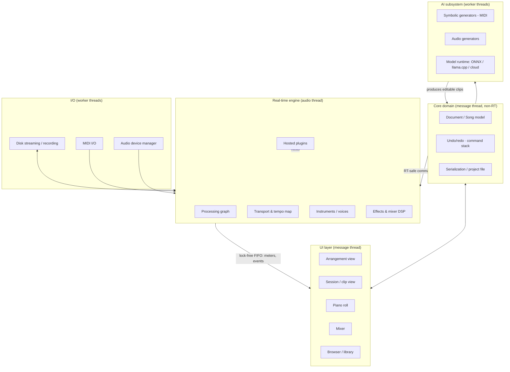
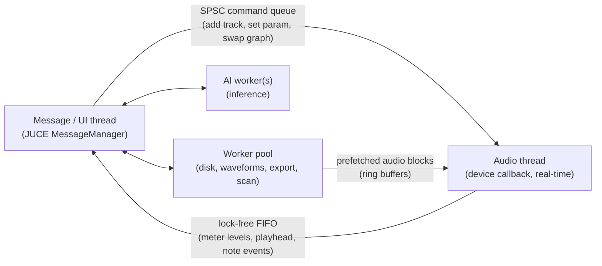
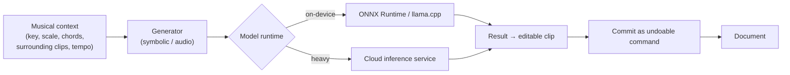

# Looper-Audio — Build Plan

A cross-platform **Digital Audio Workstation (DAW)** in C++ for arranging and generating
music, in the spirit of FL Studio, Ableton Live, and Reason — with a **generative / AI-assist
layer** as its defining feature.

> **Direction chosen:** serious, shippable product · JUCE foundation · hybrid DAW + AI assist ·
> cross-platform (macOS, Windows, Linux) · multi-year phased roadmap.

This is a living document. As sections mature they should graduate into their own files
(`ARCHITECTURE.md`, `ROADMAP.md`, `AI.md`), and this file becomes the index.

---

## Table of contents

1. [Product vision & positioning](#1-product-vision--positioning)
2. [Scope & non-goals](#2-scope--non-goals)
3. [Technology stack](#3-technology-stack)
4. [High-level architecture](#4-high-level-architecture)
5. [The real-time audio engine](#5-the-real-time-audio-engine-the-heart)
6. [Document & data model](#6-document--data-model)
7. [Plugin hosting](#7-plugin-hosting)
8. [The UI layer](#8-the-ui-layer)
9. [Built-in instruments & effects](#9-built-in-instruments--effects)
10. [The AI / generative subsystem](#10-the-ai--generative-subsystem-the-differentiator)
11. [Cross-platform & packaging](#11-cross-platform--packaging)
12. [Testing & QA strategy](#12-testing--qa-strategy)
13. [Proposed project structure](#13-proposed-project-structure)
14. [Phased roadmap](#14-phased-roadmap)
15. [Key risks & mitigations](#15-key-risks--mitigations)
16. [Immediate next steps](#16-immediate-next-steps)
17. [Next planned features: MIDI I/O, file manager 2.0, piano-roll & drum tools](#17-next-planned-features-midi-io-file-manager-20-piano-roll--drum-tools)
18. [Next planned features: project-format versioning, metronome, editable clips & notes](#18-next-planned-features-project-format-versioning-metronome-editable-clips--notes)
19. [Session view: clip launching and scenes](#19-session-view-clip-launching-and-scenes)
20. [Plugin hosting](#20-plugin-hosting)
21. [A guitar instrument and its pane](#21-a-guitar-instrument-and-its-pane)
22. [Appendix: reference reading](#22-appendix-reference-reading)

---

## 1. Product vision & positioning

**Looper-Audio** is a **loop-centric, AI-assisted DAW**. The name points at the identity: a
workflow built around clips and loops (like Ableton's Session View) rather than only a linear
tape timeline, with generative assistance that accelerates *ideation* while keeping every result
fully editable.

- **Who it's for:** producers who work loop-first — electronic, hip-hop, pop, lo-fi, scoring
  sketches — who want to move from idea to arrangement quickly.
- **The wedge (why it's different):** most DAWs treat AI as a bolt-on. Looper-Audio treats
  *generation* as a first-class citizen woven into the workflow: generate a melody in the current
  key/scale over the current chords, get four variations of a drum loop, extend a clip, fill
  harmony — all producing normal MIDI/audio clips you can edit by hand.
- **Guiding principles:**
  - **The human stays in control.** AI produces editable musical data, never an opaque black box in the signal path.
  - **Rock-solid real-time core.** Audio glitches are unforgivable; the engine's correctness and latency come before features.
  - **Loop-first, arrangement-ready.** Fast to jam, complete enough to finish a song.
  - **Cross-platform parity.** macOS and Windows first-class; Linux supported.

Competing feature-for-feature with 20-year-old incumbents is not the goal. Winning a *workflow*
(loop-centric + generative) is.

---

## 2. Scope & non-goals

**In scope (the product surface over the roadmap):**

- Multi-track audio + MIDI recording, editing, arranging
- Loop/clip launching (session view) **and** a linear arrangement timeline
- Piano roll, step sequencer, automation
- Mixer with routing, sends/returns, sidechaining
- Built-in instruments (synths, sampler, drums) and effects (EQ, dynamics, delay, reverb, …)
- Third-party plugin hosting: **VST3 + AU** first, **CLAP** later
- Generative/AI assistance: symbolic (MIDI) generation first, audio-domain generation later
- Offline render/export, stems, project save/load
- Signed, notarized installers per platform

**Non-goals (at least through 1.0):**

- Notation/score engraving (Sibelius/Dorico territory)
- Video editing (basic video-for-scoring reference at most, and only post-1.0)
- Hardware DSP / dedicated audio-interface driver development
- A cloud collaboration platform (interesting post-1.0, not core)
- Being a plugin *first* — Looper-Audio ships as an **application**; running the engine as a
  hostable plugin is a post-1.0 stretch goal.

---

## 3. Technology stack

| Concern | Choice | Notes |
|---|---|---|
| Language | **C++20** (consider C++23 where toolchains allow) | Concepts, `std::span`, `<atomic>` improvements, `constexpr` DSP tables. |
| App/audio framework | **JUCE 8** | Audio device I/O, MIDI, plugin hosting, GUI, cross-platform. Fastest credible path. |
| Build system | **CMake** (≥ 3.24) | Already implied by `.gitignore`. JUCE has first-class CMake support. |
| Dependencies | **vcpkg** (manifest mode) + **CPM.cmake** for JUCE | `.gitignore` already lists `vcpkg_installed/`. Pull JUCE via CPM or vcpkg. |
| Audio backends | CoreAudio (mac), WASAPI/ASIO (win), ALSA/JACK/PipeWire (linux) | All wrapped by JUCE's `AudioDeviceManager`. ASIO SDK has its own license. |
| Plugin formats hosted | VST3, AU (→ CLAP later) | VST3 SDK: GPLv3 or Steinberg proprietary agreement. AU is free on macOS. |
| DSP helpers | `juce::dsp`, plus targeted libs | Vectorized filters/FFT. Add specialist libs as needed (see below). |
| Time-stretch / pitch | **Rubber Band** or **SoundTouch** | Rubber Band is higher quality; check its dual GPL/commercial license. |
| Stem separation | **Demucs** (via ONNX/LibTorch) | Post-1.0 AI-adjacent feature. |
| ML inference (on-device) | **ONNX Runtime** (C++), and/or **llama.cpp/ggml** for transformer music-LMs | CPU + GPU execution providers; quantized models. |
| ML inference (cloud) | Pluggable service abstraction | For heavy audio-domain generation. Keep vendor-swappable. |
| Testing | **Catch2** or **GoogleTest**, plus **pluginval** | DSP unit tests, host/plugin validation. |
| CI | **GitHub Actions** matrix (mac/win/linux) | Build + test + artifact packaging. |
| Crash/telemetry | Sentry/Crashpad or Breakpad (opt-in) | Essential for a shipped desktop app. |

### Licensing budget (do not skip — this gates a commercial product)

- **JUCE (mid-2026):** dual-licensed **AGPLv3** *or* commercial. AGPL is unsuitable for a
  closed-source commercial DAW (network-copyleft), so plan on a commercial tier: **Personal**
  (free, under a revenue cap, adds a splash screen), **Indie ≈ $40/yr**, **Pro ≈ $800/yr**.
  *Verify current terms at [juce.com/get-juce](https://juce.com/get-juce/).*
- **VST3 SDK:** GPLv3 or a proprietary agreement with Steinberg.
- **ASIO SDK:** Steinberg license; can't be redistributed — users may use ASIO4ALL, or you sign the agreement.
- **AAX (Pro Tools):** Avid agreement + PACE signing — out of scope initially.
- **AI model weights:** licenses vary widely and **some forbid commercial use** (e.g., certain
  MusicGen weights are CC-BY-NC). Audit every model's license before shipping; prefer permissive/commercial-friendly weights.

---

## 4. High-level architecture

The single most important structural decision: **separate the real-time audio engine from the UI
and from the AI subsystem by hard boundaries.** They run on different threads and communicate only
through real-time-safe channels. Everything else follows from this.


```mermaid
flowchart TB
    subgraph UI["UI layer (message thread)"]
        AV[Arrangement view]
        SV[Session / clip view]
        PR[Piano roll]
        MX[Mixer]
        BR[Browser / library]
    end

    subgraph CORE["Core domain (message thread, non-RT)"]
        DOC[Document / Song model]
        UNDO[Undo/redo · command stack]
        SER[Serialization / project file]
    end

    subgraph AI["AI subsystem (worker threads)"]
        GENSYM[Symbolic generators - MIDI]
        GENAUD[Audio generators]
        RT[Model runtime: ONNX / llama.cpp / cloud]
    end

    subgraph ENGINE["Real-time engine (audio thread)"]
        GRAPH[Processing graph]
        TRANSPORT[Transport & tempo map]
        VOICES[Instruments / voices]
        FX[Effects & mixer DSP]
        PLUGS[Hosted plugins]
    end

    subgraph IO["I/O (worker threads)"]
        DISK[Disk streaming / recording]
        MIDIIO[MIDI I/O]
        DEV[Audio device manager]
    end

    UI <--> CORE
    CORE -- "RT-safe command queue" --> ENGINE
    ENGINE -- "lock-free FIFO: meters, events" --> UI
    AI -- "produces editable clips" --> CORE
    CORE --> AI
    DISK <--> ENGINE
    DEV --> ENGINE
    MIDIIO --> ENGINE
    PLUGS -.hosts.- ENGINE
```

**Layer responsibilities**

- **UI layer** — JUCE components. Renders state, captures intent. Never touches the audio thread directly.
- **Core domain** — the source of truth: the song/document model, undo/redo, serialization. Lives
  on the message thread; mutated only via commands.
- **Real-time engine** — the audio callback and everything it touches. Wait-free. Receives an
  immutable/RT-safe view of what to play; emits meters and events back.
- **AI subsystem** — off to the side. Consumes musical context, produces editable MIDI/audio that
  gets committed to the document like any user edit. **Never in the signal path.**
- **I/O** — disk streaming/recording, MIDI, device management, all on worker threads.

---

## 5. The real-time audio engine (the heart)

A DAW lives or dies here. The audio callback runs on a high-priority OS thread with a hard
deadline (e.g., at 48 kHz / 128-frame buffer you have **~2.7 ms** to produce every block). Miss it
and the user hears a click.

### The golden rules (non-negotiable on the audio thread)

- **No locks** (no mutexes, no priority inversion).
- **No allocation/deallocation** (`new`/`delete`/`malloc`/`free`, and no container growth).
- **No file, socket, or blocking syscalls.**
- **No exceptions thrown across the callback.**
- **No unbounded work** — every path is O(bounded) per block.
- **Allocate on the message thread, hand ownership to the audio thread via a queue; free back on
  the message thread.** The audio thread never constructs or destroys heap objects.

### Thread & communication model


```mermaid
flowchart LR
    MT["Message / UI thread<br/>(JUCE MessageManager)"]
    AT["Audio thread<br/>(device callback, real-time)"]
    WK["Worker pool<br/>(disk, waveforms, export, scan)"]
    AIW["AI worker(s)<br/>(inference)"]

    MT -- "SPSC command queue<br/>(add track, set param, swap graph)" --> AT
    AT -- "lock-free FIFO<br/>(meter levels, playhead, note events)" --> MT
    MT <--> WK
    MT <--> AIW
    WK -- "prefetched audio blocks<br/>(ring buffers)" --> AT
```

- **Message → audio:** a single-producer/single-consumer command queue. UI edits become commands
  (`SetParameter`, `AddNode`, `SwapGraphState`). Graph structural changes are done by building the
  new state on the message thread and atomically swapping a pointer (RCU-style); the old state is
  reclaimed later on the message thread.
- **Audio → message:** a lock-free FIFO for meter values, playhead position, and MIDI/automation
  events for display.
- **Parameters:** each automatable parameter is an atomic with a value-smoother on the audio side
  to avoid zipper noise.
- **A small, heavily-tested RT-primitives module** (`SpscQueue`, `LockFreeFifo`, `AtomicParam`,
  object pools) is the foundation everything else trusts. Build and test this first.

### Processing graph

- Nodes: tracks (audio/MIDI), instruments, effects, sends/returns, groups, master bus.
- Rendered in topological order per block; latency-compensated (**plugin/effect delay
  compensation, PDC**) so parallel paths stay phase-aligned.
- **Start with `juce::AudioProcessorGraph`** to move fast; expect to **evolve toward a custom
  graph** for finer control (parallel rendering across a thread pool, sample-accurate parameter
  changes, deterministic ordering). Design the node interface so the backing implementation can be
  swapped.

### Transport, time & sync

- Sample-accurate transport: play/stop/record, loop region, punch in/out.
- **Tempo map** (tempo + time-signature changes over the timeline) with musical position in PPQ;
  everything schedules against it.
- **Ableton Link** for tempo/beat sync with other apps and devices (core to a loop-centric DAW).
- MIDI clock / MTC as secondary sync options.

### Voices, mixing, and disk streaming

- Instruments use a **voice architecture** (voice pool, allocation/stealing, per-voice DSP).
- **Audio clips stream from disk** via background prefetch into ring buffers (never load whole
  files into RAM); recording writes through a background thread.
- Mixer DSP: gain/pan, sends, buses, sidechain routing — all block-based and branch-light.

---

## 6. Document & data model

The **Song/Document** is the authoritative, non-RT representation. The engine derives its RT state
from it; the UI renders it; the AI edits it.

- **Hierarchy:** `Song → Tracks → Clips → (MIDI notes / audio region + fades) `, plus `Buses`,
  `Sends`, `AutomationLanes`, `TempoMap`, `Markers`, `Scenes` (for session view).
- **Two timelines share one model:** an **arrangement timeline** (linear) and **session scenes**
  (clip grid). Clips are the common unit.
- **Undo/redo via the command pattern.** Every mutation is a reversible command; the command stack
  is the only way the document changes. This also gives a clean seam for scripting and AI edits
  (an AI result is just a command).
- **Serialization / project file:**
  - Human-diffable, forward-compatible container. Options: a documented JSON/XML manifest +
    binary blobs for audio, packaged in a project *bundle/folder* (like Ableton's `.als` in a
    project folder). Version every schema from day one.
  - Reference external audio by content hash; keep a "collect and save" to bundle assets.
- **IDs & references:** stable UUIDs for tracks/clips/params so automation, plugin state, and AI
  targets survive edits.

---

## 7. Plugin hosting

- **Formats:** **VST3** and **AU** (macOS) first — both hostable natively via JUCE. **CLAP** later:
  hosting is not native to JUCE yet (only alpha community modules such as `juce_clap_hosting`), and
  CLAP *authoring* lands in **JUCE 9**. **AAX** is out of scope initially.
- **Scanning:** scan/validate plugins **out-of-process** so a broken plugin can't crash the app
  during scan; cache a known-good plugin list.
- **Reliability:** third-party plugins crash. Start **in-process** for speed, but design the host
  boundary so a future **out-of-process / sandboxed** hosting mode can be dropped in (crash
  isolation is a real differentiator for stability).
- **State & automation:** persist plugin state blobs in the project; expose plugin parameters to
  the automation and modulation systems; manage plugin editor windows on the message thread.
- **Validation:** run **`pluginval`** in CI against anything we host or author.

---

## 8. The UI layer

Built with JUCE components, fully decoupled from the engine (renders document state + reads the
audio→UI FIFO for live meters/playhead).

**Primary views:**

- **Session view** — clip/scene grid, launch quantization, the "loop jamming" surface (identity view).
- **Arrangement view** — linear timeline, tracks, clips, automation lanes, ranges/markers.
- **Piano roll** — MIDI note editing, scales/chords overlay, quantize/humanize, and the entry
  point for symbolic AI generation.
- **Step sequencer** — drum/pattern programming.
- **Mixer** — channel strips, sends, routing, metering, plugin slots.
- **Browser/library** — instruments, effects, presets, samples, loops, and generated content.

**UI engineering notes:**

- Custom look-and-feel and a component library; GPU-accelerated rendering path where JUCE allows
  (JUCE 8's rendering improvements help with dense timelines/waveforms).
- Waveform/thumbnail rendering happens on worker threads and is cached.
- Keep the UI responsive by never blocking the message thread on disk/AI/plugin work.
- Plan for **accessibility** (JUCE accessibility API), theming/scaling (HiDPI), and full keyboard
  control early — retrofitting these is painful.

### Dockable workspace (implemented)

The original shell was a fixed layout: a transport sidebar plus a single `juce::TabbedComponent`
holding Arrange/Edit/Mixer as three tabs — only one of which could ever be visible, which made it
impossible to watch levels on the mixer while editing the arrangement. Three designs were
considered:

- **(A) Full custom drag-anywhere docking** (VS Code / Qt Advanced Docking System style) — most
  capable (arbitrary floating windows, live drop-zone previews, recursive splitting), but a large
  standalone engineering effort with real visual-polish risk.
- **(B) Generalize the existing split into an N-way region layout**, each region a tab group panels
  can be dragged between — chosen. Satisfies "use arrangement and mixer at once" with much less
  risk and no new dependency; the region layout is itself the foundation a fuller system (A) could
  later add floating/recursive-splitting on top of.
- **(C) A third-party JUCE docking library** — rejected for now; would need explicit sign-off given
  this project's existing licensing-budget discipline (§3) around new dependencies.

**What was built:** `src/app/DockRegion.h` — a self-contained tab-group component (custom
paint/mouse handling, not a `TabbedComponent` subclass, to keep full control of the drag gesture).
`MainComponent`'s workspace is now a **Files** region, `leftPane_` (transport, unchanged), and
**two more** `DockRegion`s side by side, separated by draggable dividers
(`juce::StretchableLayoutManager`, now 7 items). Default layout: Files owns its own region,
Arrange + Edit share region A, Mixer owns region B. Dragging a tab header onto another region
(`DragAndDropContainer`/`DragAndDropTarget`) moves that panel there via
`MainComponent::movePanelBetweenRegions`. **The layout now persists** across restarts: each of the
four known panels' current region, plus which panel is active within each region, is written to an
app-level `juce::PropertiesFile` (`~/Library/Application Support/Looper-Audio/` on macOS — separate
from the `.looper` project file, since this is a workstation preference, not song data) on every
panel move and on shutdown. Loading is defensive by construction rather than by validating a blob:
it asks each of the four hardcoded panel names "which region were you saved in," and silently leaves
a panel in its constructor-assigned default region if nothing (or something unrecognized) is found
— so a missing settings file, a stale value, or a future panel that didn't exist when it was saved
all fail safe rather than needing explicit corruption handling.

Verification: pure UI-shell change, zero engine/model impact — all unit tests and the bounce tool's
full check suite (including the `rmsDry=0.149266` regression sentinel) are unchanged. The drag
gesture, visual layout, and — for persistence specifically — actually restarting the app to confirm
a moved panel and the active tab come back where they were, could not be verified headlessly and
need a live try.

### File-management pane (implemented)

A left-side panel (`src/app/FileBrowserPanel.h`) to browse and drag audio files into the
arrangement, docking into the system above as its own default region (drag its tab elsewhere like
any other panel).

- **Browsing:** JUCE's built-in `juce::FileTreeComponent` (backed by `DirectoryContentsList` +
  `TimeSliceThread`), filtered to `*.wav;*.aiff;*.aif;*.flac;*.ogg;*.mp3;*.m4a;*.mp4`. "Places" has
  two always-present buttons — **Home** and **Recordings** (bookmarking
  `MainComponent::recordingsDirectory()`) — plus a **user-editable bookmark list**: a **+** button
  opens a folder picker to add one, right-click a bookmark to remove it (`BookmarkButton`, a small
  `TextButton` subclass that also reports `ModifierKeys::isPopupMenu()` clicks). Bookmarks persist
  in the same app-level `juce::PropertiesFile` the dockable-workspace layout uses (joined with `\n`
  via `StringArray::joinIntoString`/`fromLines`, since folder paths won't contain literal newlines)
  — `FileBrowserPanel` only holds and displays the list; `MainComponent` owns saving/loading it,
  same separation of concerns as the dock layout above.
- **Drag-out:** implemented via type, not the drag's description string — `ArrangementView` (now
  also a `juce::DragAndDropTarget`) accepts a drag only when `SourceDetails::sourceComponent` is a
  `juce::FileTreeComponent`, reading the actual file back off it via `getSelectedFile(0)`, and
  computing the drop beat with the existing `TimelineGeometry::beatForX`. `DockRegion` explicitly
  rejects the same drags (by the same type check) so a file dropped on a region's tab strip doesn't
  get misinterpreted as a panel-move — JUCE resolves nested `DragAndDropTarget`s by walking up from
  the deepest hit component, so `ArrangementView` (nested inside a `DockRegion`) is asked first.
- **Backend — no new engine work:** dropping a file (or picking one via "Import Audio to
  Track...") both now funnel through one shared `MainComponent::importAudioFileAtBeat(file,
  startBeats)` — the same `AudioEngine`-track-creation + `history_.edit(...)` pattern this project
  already had, just parameterized on the start beat (0 for the dialog, the drop position for a
  drag) instead of duplicated.
- **Preview/audition:** double-clicking a file in the browser calls the same
  `MainComponent::previewAudioFile(file)` helper "File > Import Audio..." already used (also
  de-duplicated out of that menu action's callback).
- **Format-scope decision, as planned:** the filter includes `.mp4`/`.m4a`, which JUCE's
  `CoreAudioFormat` can decode when the container is audio-only (e.g. AAC in an M4A/MP4 box) — no
  new code needed for that case. Genuine video `.mp4` files will simply fail to decode
  (`AudioEngine::loadAudioFileForTrack` returns false, same as any unsupported file) since no
  demuxer was added — extracting audio from real video remains an explicitly separate, harder
  follow-up (AVFoundation/`AVAssetReader` on Apple, or a cross-platform demuxer dependency).
- Additive only, unchanged: **File > Import Audio to Track...** and **File > Import Audio...**
  still work exactly as before.

Verification: builds clean, all 50 unit tests and the bounce tool's full check suite (including
`rmsDry=0.149266`) are unchanged — this only added a new front door onto already-verified
`AudioEngine`/`history_` machinery. What can't be verified headlessly: the actual drag gesture, the
file tree rendering, and whether a real audio-only `.m4a`/`.mp4` decodes via `CoreAudioFormat` on
this machine — try dragging a `.wav` and an `.m4a` from the panel into the arrangement live.

---

## 9. Built-in instruments & effects

A DAW needs a credible factory set so it's usable without third-party plugins.

- **Reusable DSP core** (`dsp/`): oscillators (band-limited), filters (SVF, ladder), envelopes,
  LFOs, FFT, oversampling, saturation, delay lines, interpolation. Unit-tested against reference.
- **Instruments:**
  - Subtractive/wavetable **synth** (poly voice engine).
  - **Sampler** with disk streaming, zones/velocity layers, round-robin.
  - **Drum machine** / kit sampler tied to the step sequencer.
- **Effects suite:** EQ, compressor/limiter, gate, delay, reverb (algorithmic + convolution),
  chorus/flanger/phaser, distortion/saturation, stereo tools, utility/gain.
- **Modulation:** a matrix routing LFOs/envelopes/macros to parameters (host-side, so it works for
  built-ins *and* hosted plugins).
- Ship **factory presets and a loop/sample library** as installable content packs.

---

## 10. The AI / generative subsystem (the differentiator)

The design rule that keeps this sane: **AI is an asynchronous generator that produces editable
musical data — it is never in the real-time signal path.** Generation runs on worker threads; a
result becomes a normal clip/pattern committed to the document via a command (so it's undoable and
hand-editable).

### Two domains, sequenced deliberately

1. **Symbolic (MIDI) generation — build this first.** Highest value per unit effort: output is
   MIDI you can edit, it's cheap enough to run on-device, and it slots straight into the piano roll
   and step sequencer.
   - *Non-ML first:* music-theory helpers — scale/chord constraint, voice-leading, arpeggiation,
     humanization, Markov/grammar-based pattern variation. Deterministic, instant, no model weights,
     genuinely useful.
   - *ML next:* transformer music-LMs for melody/continuation/accompaniment (e.g. anticipatory /
     infilling models), drum-pattern models. Run via **ONNX Runtime** or a quantized model through
     **llama.cpp/ggml**.
   - *Use cases:* "generate a melody in this key/scale over these chords," "4 variations of this
     drum loop," "extend this clip," "suggest a bassline," "fill harmony," "humanize timing/velocity."

2. **Audio-domain generation — later, and mostly cloud.** Text-to-loop, one-shot/sample
   generation, and stem work.
   - Open models exist (MusicGen / AudioCraft, Stable Audio Open) but are **heavy**; good quality
     on-device needs a GPU. Realistic path: a **pluggable inference service** (self-hosted or
     third-party) for the heavy lifting, with on-device for smaller tasks.
   - *AI-adjacent DSP that's high value and cheaper:* **stem separation** (Demucs), **tempo/key
     detection**, **smart quantize/warp**, **pitch correction** — deliver these alongside generation.

### Runtime & integration


```mermaid
flowchart LR
    CTX["Musical context<br/>(key, scale, chords,<br/>surrounding clips, tempo)"]
    --> GEN["Generator<br/>(symbolic / audio)"]
    GEN --> RUNTIME{"Model runtime"}
    RUNTIME -->|on-device| ONNX["ONNX Runtime / llama.cpp"]
    RUNTIME -->|heavy| CLOUD["Cloud inference service"]
    ONNX --> RESULT["Result → editable clip"]
    CLOUD --> RESULT
    RESULT --> CMD["Commit as undoable command"]
    CMD --> DOC["Document"]
```

- **Model runtime abstraction:** one interface, multiple backends (on-device ONNX, on-device
  llama.cpp/ggml, remote service). Backends are swappable and testable in isolation.
- **Context builder:** gathers the musical context (key/scale/chords, neighboring clips, groove,
  tempo) so generation is *conditioned on the project*, not generic.
- **UX patterns:** contextual "Generate" actions in the piano roll / step sequencer / browser;
  always return **multiple candidates**; everything lands as editable MIDI/audio; nothing is
  destructive.
- **Licensing & privacy:** audit each model's weight license (some forbid commercial use); make
  cloud generation opt-in and transparent about what leaves the machine.

---

## 11. Cross-platform & packaging

| Platform | Audio backends | Packaging | Signing |
|---|---|---|---|
| **macOS** | CoreAudio | universal binary (arm64 + x86_64), `.dmg`/`.pkg` | Developer ID + **notarization** |
| **Windows** | WASAPI (shared/exclusive), ASIO | MSVC build, installer (WiX / Inno / NSIS) | Authenticode (EV cert) |
| **Linux** | ALSA, JACK, PipeWire | AppImage / Flatpak / `.deb` | — (community-supported tier) |

- **Priority:** macOS + Windows first-class from day one (both in CI); Linux supported and
  community-tested.
- JUCE abstracts the audio/MIDI/GUI differences; the work is in **build/signing/packaging** and
  device-specific QA (driver/buffer edge cases).
- Automate installer builds in CI so every commit can produce artifacts.

---

## 12. Testing & QA strategy

- **DSP unit tests** (Catch2/GoogleTest): impulse/step responses, frequency response, gain
  staging, null tests against reference renders within tolerance.
- **RT-primitives tests:** hammer the lock-free queues/pools under contention; run under
  **ThreadSanitizer** and **UBSan/ASan** (note: TSan + real-time audio is delicate — test the
  primitives standalone).
- **Audio regression:** render a fixed project to WAV, compare against a golden file within
  tolerance; fail CI on drift.
- **Plugin validation:** run **`pluginval`** against hosted/authored plugins.
- **CI matrix:** GitHub Actions on macOS/Windows/Linux — build, test, package artifacts.
- **Real-time safety discipline:** a lightweight "is this called on the audio thread?" assertion in
  debug builds catches accidental locks/allocations early.
- **Performance budgets:** track CPU per voice/effect and round-trip latency; regressions are bugs.

---

## 13. Proposed project structure

```
Looper-Audio/
├─ CMakeLists.txt
├─ vcpkg.json                 # manifest: catch2, onnxruntime, rubberband, …
├─ cmake/                     # toolchain files, CPM.cmake, JUCE helpers, signing
├─ docs/
│  ├─ PLAN.md                 # this document
│  ├─ ARCHITECTURE.md         # (graduates out of §4–§7)
│  └─ AI.md                   # (graduates out of §10)
├─ src/
│  ├─ rt/                     # lock-free primitives, object pools, RT assertions  ← build first
│  ├─ core/                   # Song/document model, commands, undo, serialization
│  ├─ engine/                 # real-time graph, transport, mixer, voices
│  ├─ dsp/                    # reusable DSP building blocks (tested)
│  ├─ instruments/            # synth, sampler, drums
│  ├─ effects/                # eq, dynamics, delay, reverb, …
│  ├─ plugins/                # VST3/AU (later CLAP) hosting + scanning
│  ├─ ai/                     # runtime abstraction, symbolic + audio generators
│  ├─ ui/                     # JUCE components: session, arrangement, piano roll, mixer, browser
│  └─ app/                    # application shell, main(), windows, command wiring
├─ modules/                   # vendored JUCE modules / third-party
├─ tests/                     # unit + integration + regression
├─ tools/                     # asset pipeline, out-of-process plugin scanner, benchmarks
└─ resources/                 # icons, fonts, factory presets, loops
```

Design each layer to depend only *downward* (`ui → core → engine → dsp/rt`), so the engine is
testable headless and the UI never reaches into real-time code.

---

## 14. Phased roadmap

Phased so that **every phase ends in something you can run and hear.** No calendar dates — a
serious DAW is a multi-year effort; these are ordered milestones, not deadlines. Each phase is a
vertical slice that de-risks the next.

| Phase | Theme | Definition of done |
|---|---|---|
| **0** | **Foundations** | CMake + vcpkg + JUCE build on mac/win/linux; CI green; app window opens; audio callback emits a test tone; **`rt/` lock-free primitives written and tested**; logging + crash reporting. |
| **1** | **Engine & transport (vertical slice)** | Processing graph + master bus; transport (play/stop/loop); tempo/time-sig map; play a WAV through the graph in time; metering to the UI. Proves the architecture end-to-end. |
| **2** | **MIDI + first instrument** | MIDI I/O; polyphonic synth voice engine; note scheduling; minimal piano roll. Hear MIDI drive a built-in synth on the grid. |
| **3** | **Document, tracks, clips, arrangement** | Full song model; audio+MIDI tracks; clips on a timeline; arrangement view; **undo/redo**; save/load project; audio recording; disk streaming. |
| **4** | **Mixer, routing, effects, automation** | Mixer with sends/returns/sidechain; built-in effects suite; automation lanes; offline bounce/export to WAV. |
| **5** | **Plugin hosting** | VST3 + AU hosting; out-of-process scanning; plugin windows; plugin state + automation. |
| **6** | **The "Looper" identity** | Session/clip launching; scenes; loop-centric workflow; **Ableton Link**; warping/time-stretch (Rubber Band); step sequencer. Product identity crystallizes. |
| **7** | **AI / generative layer** | Model-runtime abstraction; **symbolic MIDI generation first** (melody/chords/drums, variation/continuation, humanize) + music-theory helpers; then audio-domain (cloud text-to-loop, stem separation, tempo/key detection). All async, all editable. |
| **8** | **Polish & release engineering** | CPU/latency optimization (parallel graph rendering); accessibility; factory content; onboarding; signed/notarized installers; licensing/activation; docs; **beta → 1.0**. |
| **post-1.0** | **Beyond** | Ship the engine as a hostable plugin (VST3/AU/CLAP); collaboration/cloud sync; MIDI 2.0 / MPE; mobile companion; marketplace. |

---

## 15. Key risks & mitigations

| Risk | Why it's serious | Mitigation |
|---|---|---|
| **Sheer scope** | Commercial DAWs represent *hundreds* of person-years. This is the #1 killer. | Ruthless MVP; ship vertical slices; win a workflow (loop + AI), don't clone incumbents; consider a narrow, opinionated feature set. |
| **Real-time correctness** | Lock-free bugs are subtle, rare, and platform-specific; glitches are unforgivable. | Small tested `rt/` layer; the "allocate on message thread" rule; TSan on primitives; audio-thread assertions in debug. |
| **AI cost / latency / quality** | Good audio generation is heavy; cloud adds cost, latency, privacy concerns. | Lead with symbolic MIDI (cheap, editable, high value); make audio gen optional/cloud; pluggable backends. |
| **Licensing** | JUCE AGPL unsuitable for closed source; SDK agreements; **some model weights forbid commercial use**. | Budget JUCE Indie/Pro; sign VST3/ASIO agreements as needed; audit every model license before shipping. |
| **Cross-platform QA** | 3 OSes × many audio devices/drivers/buffer sizes. | CI matrix; mac+win first-class, Linux community tier; automate packaging. |
| **Plugin stability** | Third-party plugins crash and take the app down. | Out-of-process scanning now; design for out-of-process hosting later. |
| **Solo/small-team bandwidth** | Burnout and stall on a years-long build. | Keep each phase independently runnable/demoable; the loop-jam workflow is usable well before "full DAW." |

---

## 16. Immediate next steps

Concrete, in order — the first three get you to *hearing sound through your own code*:

1. **Scaffold the build.** `CMakeLists.txt` + `vcpkg.json`, pull **JUCE via CPM**, produce an empty
   JUCE app window that builds and runs on your Mac.
2. **Wire CI.** GitHub Actions matrix (macOS + Windows + Linux) building the scaffold; artifacts on green.
3. **Vertical slice — make noise.** Audio device callback → **test tone** → metering to the UI; then
   play a WAV through a minimal graph with a working transport (Phase 0 → into Phase 1).
4. **Build `rt/` first.** The lock-free SPSC command queue, audio→UI FIFO, object pool, and the
   audio-thread assertion — with tests. Everything trusts this layer.
5. **Write the threading contract** into `docs/ARCHITECTURE.md`: exactly what may/may not happen on
   each thread, and how message↔audio communication works. This document prevents the class of bug
   that's hardest to fix later.

---

## 17. Next planned features: MIDI I/O, file manager 2.0, piano-roll & drum tools

Four features requested together, each independent enough to build and verify on its own. Suggested
build order — smallest/lowest-risk first, and drum kits last since it genuinely benefits from two of
the others already existing:

1. Piano-roll key-name gutter (smallest, standalone).
2. MIDI import/export (standalone).
3. File manager 2.0 (standalone; also lays down the drag-onto-a-pad infrastructure drum kits reuse).
4. Drum kits (largest; reuses #1's gutter pattern and #3's drag-and-drop).

Each subsection below flags the judgment calls made so they're visible before implementation starts,
rather than buried in code.

### MIDI import/export (implemented)

Read and write Standard MIDI Files (`.mid`) so patterns can come from, or go to, other tools —
no new dependency: `juce::MidiFile` (already-linked `juce_audio_basics`) parses/writes SMF headers,
per-track `juce::MidiMessageSequence`s, and tempo/time-signature meta-events.

**What was built:** `src/engine/MidiFileIO.h` — engine layer, not model/, since it needs JUCE (same
reasoning that already puts `OfflineRenderer.h` in engine/ despite needing `juce_audio_formats`).
Two entry points, both JUCE-dependent, both operating on `model::Song`:

- `MidiImportResult importMidiFile(const juce::File&, model::Song&)` — one new `Instrument` track
  per imported MIDI track with at least one note (a tempo-only or otherwise note-less track imports
  nothing); each track's note on/off pairs (matched via JUCE's own
  `MidiMessageSequence::updateMatchedPairs`/`noteOffObject`) become `engine::Note{startBeats,
  lengthBeats, noteNumber, velocity}` via tick→beat conversion using `MidiFile::getTimeFormat()`
  (ticks per quarter note). Each imported track gets one clip spanning its whole content,
  `startBeats = 0`, the existing "single clip = unbounded, plays until stop" convention rather than
  multi-clip splitting something that doesn't need it. `MidiImportResult` reports
  `tracksImported`/`extraTempoEventsIgnored` rather than a bare bool, so the UI can say exactly
  what happened.
- `bool exportMidiFile(const juce::File&, const model::Song&)` — the reverse: one
  `MidiMessageSequence` per Instrument track, flattening *all* of that track's clips onto one
  continuous sequence at their timeline positions (each clip's `startBeats` becomes a tick offset,
  at a fixed 960-ticks-per-quarter-note resolution), plus one tempo meta-event from `song.bpm`.
  Audio tracks have nothing to export and are skipped; a track with zero notes across all its clips
  is skipped too, so the file only contains tracks that actually have content.

**Scope call — no tempo map, as planned:** the engine has one global `song.bpm`, not a
tempo-map-over-time. Import uses the file's *first* tempo event for `song.bpm` (every event after
that increments `extraTempoEventsIgnored` instead of being silently dropped or misapplied); a file
with no tempo event at all leaves the song's existing BPM untouched. SMPTE-based time formats
(`MidiFile::getTimeFormat() <= 0`) are rejected outright rather than misinterpreted.

**UI:** File > Import MIDI... / File > Export MIDI..., built the same way Import Audio / Bounce
already are (`juce::FileChooser`, `history_.edit(...)` wrapping the import mutation since it's a
real document change; export doesn't touch the document, so it isn't). Import's status message
reports the tempo actually used and any ignored tempo changes, e.g. "Imported 2 track(s) at 128.0
BPM (3 further tempo change(s) not imported)".

**Verification:** can't be a headless Catch2 test (needs JUCE) — verified by a new
`midiRoundTripWorks` bounce-tool check: a three-note `Song` at 128 BPM, exported to a temp `.mid`
and re-imported into a fresh `Song` seeded at a deliberately different BPM (90), asserting the
tempo, track/clip count, and every note's beat/pitch/velocity survived (velocity rounds through a
0–127 MIDI byte, so the tolerance accounts for that — verified to round-trip within ~0.005, well
under the check's 0.01 margin). Passed on the first run; all 57 unit tests and the bounce tool's
full check suite, including `rmsDry=0.149266`, are unchanged (no engine/model impact beyond the new
module itself).

### File manager 2.0 (implemented)

The plain `juce::FileTreeComponent` list became a two-pane file manager: the existing folder tree
on top (unchanged — still the drag-into-arrangement source), a sortable, color-coded file **grid**
below it, plus folder operations and a per-project root folder.

**What was built:** `src/app/FileGrid.h` — `juce::TableListBox` + `FileGrid : private
juce::TableListBoxModel`. Columns: Name / Type / Size / Modified / Duration (audio only, probed
lazily via the grid's own `juce::AudioFormatManager` — a file-header read, not a full decode — and
cached per path so re-sorting never re-probes). Sortable by column natively via `TableListBox`.
`src/app/FileTypeColors.h` — `classifyFile()`/`colourForFileKind()`/`labelForFileKind()`: audio
extensions one hue, `.mid`/`.midi` another, `.looper` project files a third, unrecognized dimmed —
used for both the grid's Type-column text color and a subtle per-row background tint (folders get
their own color too, for the tree).

**Layout call — simpler than first planned:** rather than splitting into a folders-only tree +
files-only grid (which would have needed a second drag-and-drop source, since `ArrangementView`/
`DockRegion` currently recognize file drags by `FileTreeComponent`'s *type*), the existing
`FileTreeComponent` was left exactly as it was — same filter, same drag-out, same double-click
preview — and the grid was added *underneath* it as a detail companion, showing whichever folder
was last clicked in the tree (or navigated to via Places). This kept the one already-proven,
working drag mechanism as the only one, at the cost of the grid not itself being a drag source in
this pass. A fixed 55/45 vertical split, not a draggable divider, for the same "keep this addition
contained" reason.

**Folder management:** right-click either the tree or the grid opens a `juce::PopupMenu`: New
Folder, Rename, Delete. New Folder/Rename use a manually-owned `juce::AlertWindow` (not
`deleteWhenDismissed = true`) because JUCE deletes an auto-delete-on-dismiss `AlertWindow` *before*
calling back — reading `getTextEditorContents()` in that callback would be a dangling-pointer bug,
so the panel owns the dialog itself, reads it, then resets it. Delete uses
`AlertWindow::showAsync` with a plain `MessageBoxOptions` confirm ("Permanently delete ... this
cannot be undone.") before calling `File::deleteRecursively()` — no custom lifetime handling
needed there since nothing is read back from the dialog afterward.

**Project root folder:** `model::Song::projectRootFolder` (`std::string`, empty = unset) —
serialization bumped to `LOOPER 10` (a `PROJECTROOT <path>` line, the path as the rest of the line
like `audioFile`/track `name` already are, since a real folder path can contain spaces — the
round-trip test was updated with a path that deliberately has one). Set via **File > Set Project
Root Folder...**; once set it shows as an extra, always-present "Places" button in
`FileBrowserPanel` (hidden via `setVisible(false)` *after* `addAndMakeVisible`, not before —
`addAndMakeVisible` unconditionally forces visibility true, so setting it false first and then
calling `addAndMakeVisible` would silently undo it; a real bug caught in review before it shipped).
Synced from `MainComponent::refreshFromModel()`, so it updates on new/open project and on
undo/redo, same as every other per-song UI sync already grouped there.

**Verification:** mostly filesystem/UI logic, not audio — all 57 unit tests (including the updated
serialization round-trip) and the bounce tool's full check suite, including `rmsDry=0.149266`, are
unchanged (no engine impact). The destructive folder operations, the grid's rendering/sorting, and
the dialog flows are all JUCE-dependent and need a live try before being trusted — Delete
especially, given it's irreversible.

### Piano roll: key-name gutter (implemented)

The concrete ask: a left-hand gutter naming each row's pitch ("C4", "C#4", "D4", ...) — `PianoRoll`
previously had *no* such gutter at all, the grid filled the full width with only black/white row
shading to go on. Built the same way `ArrangementView` already names its lanes
(`TimelineGeometry.gutterWidth`), applied to the pitch axis instead of the time axis.

**What was built:** `src/app/PianoRollGeometry.h` — a JUCE-free geometry struct (`pitchForRow`,
`rowForPitch`, `cellAt`, `xForStep`/`yForRow`) mirroring `TimelineGeometry`, pulled out of
`PianoRoll` itself so the row↔pitch math is unit-tested headless for the first time
(`tests/app/PianoRollGeometryTests.cpp`). Two small JUCE-free helpers moved into the existing
`engine::MidiNote.h` module rather than living in the UI layer: `midiNoteName(int)` (scientific
pitch notation, middle C = C4 — this project's existing convention, per `PianoRoll`'s demo pattern)
and `isBlackKey(int)` (previously a private, untested `PianoRoll` method) — both unit-tested in
`tests/engine/MidiNoteTests.cpp`. No JUCE note-naming API was used, since a hand-written,
JUCE-free version could be tested the same way every other pure-math helper in this project is.

Bundled, as planned: hover-row highlighting (`mouseMove`/`mouseExit`), and a heavier line every 12
rows at octave boundaries. Not bundled, as planned: scrolling/zoom, drag-to-resize notes.

**Drum-track connection:** not wired up yet — `TrackType::Drum` doesn't exist until the drum-kits
subsection below is built. `PianoRollGeometry`/`PianoRoll` are already structured so that seam (a
`labelForRow(row)` swapping pitch names for pad names) is a small, contained addition later rather
than a rewrite.

**Verification:** the row↔pitch math is now unit-tested (`PianoRollGeometryTests.cpp` plus two new
`MidiNoteTests.cpp` cases — 7 new test cases in total, all passing). The rendering itself
(gutter/hover/octave-line layout) is JUCE-dependent and could not be verified headlessly — needs a
live look. All 57 unit tests pass and the bounce tool's full check suite, including
`rmsDry=0.149266`, is unchanged (pure UI change, zero engine/model impact).

### Drum kits (implemented)

A track type where each row is an independent one-shot sample (kick, snare, hat, ...), replaceable
per-pad, instead of one melodic synth timbre shared across every note. The last, biggest item —
built on top of the piano-roll gutter (pad-name labels) and the file browser's drag-and-drop
(sample assignment), as planned.

**Model:** new `model::TrackType::Drum`. A `DrumKit` struct (`src/model/DrumKit.h`) held per-track
alongside `gainAutomation`, with a small pad list — `struct DrumPad { int noteNumber; std::string
label; std::string samplePath; };`. `model::addTrack` auto-populates the starting default the
moment a `Drum` track is created: four pads — Kick (36), Snare (38), Hat (42), Other (45),
matching "one or more bass, snare, and other instrument types" rather than a full GM drum map.
`samplePath` empty means silent, the same safe default an audio clip with no file gets. Serialization
bumped to `LOOPER 11` (a `DRUMKIT`/`DPAD` section per track; `label` is a space-free token since no
pad-rename UI exists, `samplePath` is the rest of the line like `audioFile`/track `name` already are).

**Engine:** new `engine::DrumKitNode` (`src/engine/DrumKitNode.h`), built the way
`SynthInstrumentNode` already wraps `juce::Synthesiser` — reusing its polyphony/sample-accurate
dispatch rather than a bespoke voice pool. `DrumSampleVoice : juce::SynthesiserVoice` looks up the
triggered note's assigned `ClipData` on `startNote()` (via a whole-pad-map swap — `DrumPadMap`,
the same lock-free message→audio hand-off shape as `AudioFilePlayerNode`'s clip-list swap) and
plays it once to the end, *ignoring note-off* — confirmed by reading JUCE's own
`Synthesiser::noteOff` before relying on it: a normal note-off passes `allowTailOff = true`, which
`DrumSampleVoice::stopNote` deliberately ignores (a drum hit isn't a sustained voice); only a hard
stop (`allowTailOff = false` — voice stealing, all-notes-off) cuts it immediately. Reuses
`AudioEngine::decodeOrGetCached` so assigning one sample to several pads (or tracks) never
double-decodes. `InstrumentTrack` gained a `DrumKitNode drumKit` alongside `synth`/`audioPlayer`,
plus an explicit `isDrumTrack` atomic flag routing a track's notes to one or the other —
*unlike* audio clips (which naturally stay silent with nothing submitted), the synth always
produces *some* sound for any note it receives, so Drum-track routing has to be explicit rather
than left to content-gating.

**UI:** `src/app/DrumKitEditor.h` — one row per pad (label, assigned sample name or
"(no sample)", a "Load..." button), shown above the piano roll only when the selected track is a
Drum track, *and* accepting a file dragged straight from `FileBrowserPanel`'s tree (the same
`DragAndDropTarget`-by-sourceComponent-type check `ArrangementView` established) — dropping a file
on a row reassigns that pad. `PianoRoll` gained `setDrumPads()`/`setMelodicMode()`: in drum mode
the gutter shows pad names instead of pitch names, black/white-key shading and octave lines are
skipped (neither means anything for pads), and the row count matches the pad list instead of the
usual 2-octave range. A new **Add Drum** button (mixer toolbar, next to **Add Track**) creates one.

**Bug caught in review:** `DrumKitEditor`'s implicit default constructor was, for reasons not
fully root-caused, rejected by the compiler as a `MainComponent` member (`juce::Component` +
`juce::DragAndDropTarget` multiple inheritance works fine elsewhere in this codebase without an
explicit constructor — e.g. `ArrangementView` — so this wasn't simply "that pattern needs one").
Adding `DrumKitEditor() = default;` resolved it; flagged here in case the same shape recurs.

**Verification:** exactly what the bounce tool already does well — a kick+snare pattern (kick on
beats 0/2, snare on 1/3) rendered through `DrumKitNode` via the normal sequencer path, asserting
sound in each hit's window and silence in the gaps — including a *third*, deliberately unassigned
pad (Hat) whose note fires but produces nothing, confirming a triggered-but-empty pad stays silent.
New `OfflineRenderer::renderDrumPattern` mirrors `renderClips`/`renderAudioClips`'s existing shape.
Passed on the first run. All 57 unit tests (including the updated serialization round-trip, which
now also covers a `Drum` track and a `samplePath` with a space) and the bounce tool's full check
suite, including `rmsDry=0.149266`, are unchanged.

---

## 18. Next planned features: project-format versioning, metronome, editable clips & notes

Where things actually stand: Phases 1–4 are done (multi-track sequencing, mixer, master effects,
gain automation, offline bounce) and the app shell has grown a freely splittable docking workspace
with dedicated Synth and Drums panes. What's missing is less "another subsystem" than **the ability
to write a real musical idea in it** — notes are all one length and one velocity, clips are all four
beats, there's no clipboard, and there's no click to play to.

This batch closes that gap. Build order — the format fix first because it protects work already on
disk, then smallest-to-largest:

0. **Project-format versioning** (a present bug, not a feature — see below).
1. **Metronome + count-in** (small, standalone, unblocks recording in time).
2. **Piano roll: note length, velocity, zoom/scroll.**
3. **Clip length + resize handles.**
4. **Copy/paste/duplicate, quantize, swing.**

As in §17, the judgment calls are flagged here rather than buried in the code.

### 0. Project-format versioning (implemented)

`model::deserialize` reads the version token after `LOOPER` but never *checks* it, and then requires
every record of the current format in order. Two format bumps landed in one sitting (`12` for
per-track `SynthSettings`, `13` for per-pad drum mix), which means **every project saved before those
bumps now fails to open** — the parser reaches a missing `SYNTH` line and returns `false`, surfacing
as a generic "couldn't open" with no explanation.

The fix is to treat the version as data: parse it, and make records added after version *N* optional
when reading a file older than *N*, falling back to the struct's defaults (which are already chosen
to be behaviour-preserving no-ops). Two judgment calls:

- **Forward compatibility is explicitly not offered.** A file newer than this build is rejected with
  a clear message rather than partially parsed — silently dropping records the user can't see is
  worse than refusing.
- **The reader gets the version-tolerance, not the writer.** `serialize` always emits the current
  format; there's no "save as old version". Keeps one write path and one set of tests.

Every subsequent item in this batch bumps the format again, so this lands first.

### 1. Metronome + count-in (implemented)

There is no click at all today, which makes recording in time guesswork. A metronome is a source
node driven by the existing `TempoMap`/`Transport`, emitting a short synthesized tick (accented on
the bar) — no sample assets, no new dependency.

- **Not a track.** The click is engine-level and deliberately excluded from the bounce, so it can
  never end up in an export. That means it sums in *after* the master chain rather than through it.
- **Count-in is a transport property**, not a metronome one: arm, hit record, and the transport rolls
  a configurable number of bars before the playhead starts capturing.

### 2. Piano roll: note length, velocity, zoom/scroll (implemented)

The piano roll is honest about being minimal ("fixed step length, no drag-resize, no scrolling/zoom
yet") and that is now the main thing between this app and writing an actual part. Three changes, in
order of value: drag a note's right edge to set its length; drag vertically on a note (or a velocity
lane under the grid) to set velocity; scroll and zoom the pitch range beyond the fixed two octaves.

- **`engine::Note` already carries `lengthBeats` and `velocity`** and the sequencer already honours
  both — this is a UI-side gap only, so it needs no engine work and no format change.
- **Keep the click-to-toggle step behaviour** for fast drum-style entry; length/velocity editing is
  additive, not a replacement. The drum step grid keeps its one-click-per-step model unchanged.
- Zoom/scroll wants the pitch range to become state on `PianoRollGeometry` rather than the current
  fixed `lowPitch`/`numRows` constants — which keeps the conversion math unit-testable headless, as
  it is today.

### 3. Clip length + resize handles (implemented)

Clips are created at a hardcoded 4 beats and `ArrangementView` supports moving them but not resizing
them, so an eight-bar section is unreachable. Adds a drag handle on each clip's right edge, mirroring
the existing move-drag (`onClipMoved` → `onClipResized`), plus a length field for exact values.

- **Clip length and pattern length are separate concepts** and stay separate: the clip's window on
  the timeline vs. the loop length of the pattern inside it. Resizing the window should *not*
  silently re-loop the content, so both get their own control.
- The single-clip "unbounded length" special case in `syncEngineTracks` (a lone clip loops forever)
  has to survive this, or existing projects change behaviour.

### 4. Copy/paste/duplicate, quantize, swing (implemented)

No clipboard exists anywhere in the app; duplicating a bar means redrawing it by hand. Adds
copy/paste/duplicate for both clips (in the arrangement) and note selections (in the piano roll),
then quantize and swing over a note selection.

- **An app-level clipboard holding model values**, not a system-clipboard serialization — pasting
  between two instances of the app isn't worth the format work yet.
- **Quantize needs a selection model** in the piano roll (there isn't one today — clicks toggle
  single notes), so selection lands as part of this item rather than being assumed.
- Swing is expressed as a percentage offset applied to off-beat subdivisions at edit time, writing
  real note positions rather than a playback-time feel parameter — keeps the engine unchanged and
  the result visible and editable, consistent with "AI produces editable musical data" elsewhere.

All five landed. Two things the plan didn't anticipate, recorded because they
shaped the result:

- **Clip resize alone doesn't give you a longer part.** A track holding a single clip is still
  given an unbounded window by `syncEngineTracks` (the "one clip plays until Stop" rule the plan
  said had to survive), so resizing a lone clip changes what you see and what exports, but not when
  it stops sounding. *Pattern length* is what actually makes a longer part — and the piano roll was
  hardcoded to 16 steps, so a longer clip wasn't even editable. Item 3 grew to cover all three.
- **The song's time signature was never pushed anywhere.** Both tempo maps sat at 4/4 regardless of
  the document, so a 3/4 project got the wrong bar/beat readout, the wrong loop length, and (once
  the metronome existed) its accent on every fourth beat instead of every third. Fixed as part of
  item 3, since the bars-to-beats maths depends on it.

### After this batch

The ordering beyond here, with the reasoning:

- **Per-track insert effects (implemented).** Each track now has its own filter, delay and reverb,
  pre-fader, reusing the master bus's settings structs and a new Track FX pane. Shipped as a *fixed
  trio* rather than the general chain this entry originally imagined: the engine's no-real-time-graph-
  surgery rule makes a fixed set free (members of `InstrumentTrack`, prepared once, bypassed when
  off), while an arbitrary reorderable chain needs a slot abstraction with a lock-free swap. That is
  better designed alongside plugin hosting, which forces the question anyway — so the abstraction
  moves there rather than being guessed at now.
- **Automating more than gain (implemented).** Lanes are now keyed by a `TrackParam`, so adding an
  automatable parameter is an enumerator plus the code that applies it. Gain, **pan** (which didn't
  exist as a parameter at all and had to be added first) and send level are automatable; the export
  path automates gain and pan sample-accurately. Insert-effect and synth parameters are the obvious
  next enumerators and need no new machinery. Playback is **sample-accurate** as of the follow-up
  work: tracks carry their own curves and ramp them across each block, which also let the offline
  renderer's separate isolation path be deleted — export and playback now run the same code.
- **Session view: clip launching + scenes** — the loop-first identity §1 is built around, and still
  entirely absent. Held until the items above land, because clip launching is far more compelling
  once clips are properly editable.
- **Plugin hosting**, then the **AI/generative layer** (symbolic MIDI first, which wants the
  key/scale awareness that quantize in this batch already starts to need).

Known limits not scheduled yet, recorded so they aren't rediscovered as surprises: the fixed 8-track
pool (`kMaxTracks`), RAM-only recording capped at 180 s with no disk streaming, and drum pads having
no choke groups or velocity layers.

---

## 19. Session view: clip launching and scenes (implemented)

The thing §1 says this product *is* — "a workflow built around clips and loops (like Ableton's
Session View) rather than only a linear tape timeline" — and the one major piece of that identity
that has never been built. Everything so far is a linear-timeline DAW that happens to be good at
loops.

### The shape of it

A grid: **tracks are columns, scenes are rows**, and each cell either holds a clip or is empty.
Clips are *launched* rather than positioned — you click one and it starts at the next musical
boundary and loops until something replaces or stops it. A scene launches its whole row at once.
Nothing about this is on a timeline; a session clip has no start position, only a slot.

### What v1 covers

1. **Model.** A `SessionSlot` per (track, scene), and a list of `Scene`s on the Song. Deliberately a
   *separate container* from `Track::clips` rather than a flag on the existing clips: session and
   arrangement are genuinely different things — one is a grid of alternatives, the other a sequence
   of placements — and conflating them would put a meaningless `startBeats` on every session clip.
2. **Launch quantization.** A clip launched mid-bar waits for the next bar line. This is what makes
   the workflow musical rather than a game of reflexes, so it is not optional polish.
3. **Engine playback.** Each track plays at most one session clip, looping from wherever it was
   launched. Per-track stop, and a global stop-all.
4. **UI.** A dockable Session pane: the grid, clip cells you click to launch, a scene-launch column,
   and stop buttons.
5. **Serialization**, so a session survives a save.

### Deliberately not in v1

Recording into session slots; follow actions; per-clip launch modes (gate/toggle/repeat) beyond
plain looping; audio clips in the session grid (MIDI first — audio clips need warping to be useful
at a tempo other than the one they were recorded at, and that's its own entry); and dragging clips
between the session grid and the arrangement. Each is worth having; none is needed for the workflow
to be real, and shipping them together would make the first version unverifiable.

### The decisions worth recording

- **Session and arrangement are mutually exclusive per track, chosen by the track itself.** A track
  playing a session clip ignores its timeline clips and vice versa. Ableton resolves this the same
  way (launching a clip takes the track out of arrangement playback). The alternative — summing both
  — has no musical meaning.
- **Launch quantization is engine-side, not UI-side.** The UI records "the user wants slot 3"; the
  audio thread decides *when* that becomes true, because only it knows the sample-accurate playhead.
  Doing it on the message thread would quantize to the 30 Hz timer, which is exactly the mistake the
  automation work just undid.
- **The quantum is a transport property**, like tempo — one setting for the whole session (off, 1
  bar, 2 bars...), not per clip. Per-clip quantum is an Ableton feature worth having eventually and
  is pure addition later.
- **Launching is a request, not a command.** The message thread writes a single atomic per track;
  the audio thread consumes it at the next boundary. No queue, because a second click before the
  boundary should *replace* the pending launch rather than stack up behind it — which a queue would
  get wrong and an atomic gets right for free.
- **The pattern-playback loop is shared with the arrangement sequencer** rather than copied. Both
  emit the same notes from the same Pattern; only the question of *which* pattern and *from when*
  differs. Copying it would mean two places to fix the next timing bug.

### Build order (all three landed)

Three independently verifiable stages, in this order:

1. **Model, serialization, and the launch-boundary maths** (JUCE-free and unit-tested, like
   SequencerMath and MetronomeMath before it). Nothing audible yet, but the part where an off-by-one
   is silent and permanent.
2. **Engine playback** — the session player, per-track routing, stop-all — verified by the bounce
   tool: a launched clip must sound, must start *on* the boundary and not before, and must stop when
   told.
3. **The Session pane.** Last, because by then the thing underneath it is already known to work, and
   the UI is the part that can't be verified here.

---

## 20. Plugin hosting (implemented)

VST3 and Audio Unit hosting — the thing that turns a fixed set of built-in
effects into an open one, and (per §15) the single biggest multiplier available.

**Feasibility, checked before planning rather than assumed.** JUCE 8 bundles the
VST3 SDK under `juce_audio_processors_headless/format_types/VST3_SDK` (it moved
there from `juce_audio_processors`, which is where an obvious first look fails to
find it), and AU hosting on macOS needs only system frameworks. Building the app
with `JUCE_PLUGINHOST_VST3=1` and `JUCE_PLUGINHOST_AU=1` compiles clean, so no
external SDK and no new dependency is required. Those defines are in
`src/app/CMakeLists.txt` from stage 1 onward.

### The decision this forces: one effect chain, not two

§18 shipped per-track effects as a *fixed trio* — filter, then delay, then reverb
— and said the general, reorderable chain "is better designed alongside plugin
hosting, which forces the question anyway." It does: a hosted plugin is an effect
in the same chain as the built-ins, and bolting a separate "plugin list"
alongside the trio would leave two effect concepts that each need their own
ordering, bypass, serialization and UI.

So the model becomes a **list of effect slots**, each slot being either a
built-in (filter/delay/reverb) or a hosted plugin. A slot keeps *all* the
built-in settings regardless of which kind it currently is, so switching kind
doesn't lose the others — the same pattern `SendBusSettings` already uses for its
reverb-or-delay choice.

### What the document stores for a plugin

Deliberately **JUCE-free**: a format tag, the identifier JUCE uses to find the
plugin again, a display name, and an opaque state blob. Three reasons, in order
of weight:

1. `looper_tests` links Catch2 only, so anything JUCE-typed can't be tested
   headlessly — and this is a serialization-shaped problem, exactly the kind that
   needs tests.
2. The document should survive a plugin being missing. Storing a name means a
   project that references a plugin this machine doesn't have can say *which* one
   rather than silently dropping it.
3. `juce::PluginDescription` is a UI/engine concern; converting at the boundary
   is the same split already used for `AutomationCurve` vs `AutomationLane`.

### Build order

1. **Model + serialization** (this stage). The effect chain, the plugin
   reference, and migration of the existing per-track trio into chain slots — an
   old project must come back with its effects in the same order and sounding the
   same. Testable headlessly, which is the point of doing it first.
2. **Engine.** A variable-length chain per track, replacing the fixed trio, with
   the lock-free swap the rest of the engine uses. Then plugin instantiation and
   a scan. This is the real-time-risky stage: a hosted plugin allocates, blocks,
   and misbehaves in ways the built-ins never do.
3. **UI.** A chain editor (add/remove/reorder/bypass), a plugin browser backed by
   a cached scan, and plugin editor windows. *Landed*, replacing the fixed
   filter/delay/reverb panel — which could only edit one of each, and stopped being
   true the moment a chain could hold two filters or a plugin.

### Recorded now so it isn't rediscovered

- **Scanning is in-process, and that is still outstanding.** Stage 2 shipped crash
  *recovery* (a dead man's pedal file records the plugin being probed, so one that kills
  the app is skipped next run) but not crash *isolation* — the first crash still takes the
  app down. Real isolation needs the probe in a child process. §15 lists plugin stability
  as a risk and this is the unpaid part of it.
- **`KnownPluginList` and `PluginDirectoryScanner` are GUI-module only.** `PluginHost` keeps
  its own list of descriptions instead, which is what lets the headless bounce tool scan and
  instantiate — and therefore verify hosting against a real plugin rather than a mock.
- **Hosted plugins break the engine's no-allocation rule.** They allocate in
  `prepareToPlay` and some misbehave in `processBlock`. The chain hand-off keeps
  *instantiation* on the message thread, but a badly-behaved plugin can still
  glitch audio — that's inherent to hosting, and worth stating rather than
  pretending the RT discipline extends into third-party code.
- **Plugin state is opaque and version-fragile.** It is stored as the plugin's own
  blob, base64'd. A plugin that changes its format across versions is its own
  problem, not something this document can fix.
- **Licensing.** §15 already flags it: shipping VST3 hosting means the Steinberg
  agreement, and JUCE's own licence gates a closed-source product. Neither is a
  code problem, and neither is solved by this section.

---

## 21. A guitar instrument and its pane (implemented)

A fourth track type alongside Instrument, Audio and Drum: a plucked-string
instrument that is *played like a guitar* rather than a synth patch that happens
to sound stringy. The difference between those two is almost entirely in the
performance model, not the oscillator, which is what shapes this plan.

### What actually makes it sound like a guitar

Ranked by how much each contributes, because that ordering decides what to build
first:

1. **One note per string.** A guitar has six strings and can sound at most six
   notes, one per string — and a new note on a string *cuts the one already
   ringing there*. Nothing else on this list is as audible. A polyphonic synth
   playing six notes is the single clearest giveaway that something isn't a
   guitar.
2. **Strums are not chords.** Strings are struck in sequence, roughly 10–30 ms
   apart, alternating down and up. Played simultaneously, the same six notes
   read as an organ.
3. **Per-string timbre.** The same pitch on the low E at fret 12 and on the high
   E open are different sounds — different string mass, tension and length. A
   model that only knows pitch cannot produce this.
4. **Pluck excitation and pick position.** Plucking near the bridge is bright and
   thin, over the soundhole round and full. This is a comb filter set by where
   along the string it's excited.
5. **Body resonance.** The instrument's body colours everything, and is most of
   what separates an acoustic from an electric.
6. **Articulation.** Hammer-on and pull-off (a new pitch on a *still-ringing*
   string, no new pluck), slides, bends, vibrato, palm mutes, dead notes.
7. **Noise.** Finger squeak on position changes, fret buzz, pick attack.

### Synthesis approach: extended Karplus-Strong, not samples

**Recommendation: a digital waveguide (extended Karplus-Strong) per string.**

A plucked string is one of the few instruments where physical modelling is both
cheap and genuinely convincing: a delay line whose length sets the pitch, a
lowpass in its feedback path for damping, excited by a noise burst. That is a
handful of multiplies per sample.

Why this over a sample library, which would be the other obvious answer:

- **It needs no content.** A convincing multisampled guitar is thousands of
  recordings across strings, frets, velocities and round-robins. This project has
  no sample library and no pipeline for one.
- **Articulation falls out of the model.** A hammer-on is "change the delay
  length without re-exciting" — one line. In a sampler it's a whole extra layer
  of recordings, and it's still an approximation.
- **Per-string timbre falls out too**, because each string is a separate
  resonator with its own damping and stiffness rather than a transposed copy of
  one recording.
- It fits what's already here: `DelayLine`, `StateVariableFilter`, and an engine
  built around fixed pre-allocated per-voice state.

The honest cost: it will sound like a *good synthetic* guitar, not like a
recorded one. Sampling wins on raw realism and always will. If photorealism is
the goal, this is the wrong approach and a sample library is the right one — that
choice should be made deliberately, up front, not discovered later.

### Low-level: the DSP

**The string.** For each of six strings, a delay line of length `L = sampleRate /
f0` samples, fed back through a damping filter:

```
    y[n] = filter( y[n - L] )        // the loop
```

**Fractional delay is not optional, and the existing DelayLine can't do it.**
`DelayLine::processSample` takes an `int delaySamples` and reads an integer index.
Rounding the loop length quantises pitch, and the error grows as pitch rises
because `L` shrinks. Measured at 48 kHz:

| note | f0 | delay (samples) | pitch error |
|---|---|---|---|
| E2, open low E | 82.41 Hz | 582.45 | +1.3 cents |
| E4, open high E | 329.63 Hz | 145.62 | −4.5 cents |
| E5, 12th fret | 659.26 Hz | 72.81 | −4.5 cents |
| E6, 24th fret | 1318.51 Hz | 36.40 | +19.4 cents |

Twenty cents sharp is a fifth of a semitone — audibly out of tune, and worse the
further up the neck you play. So the string needs its own delay line with a
**fractional read**: linear interpolation is the floor, a first-order allpass or
Lagrange interpolator is better because linear interpolation is itself a lowpass
and so leaks into the damping. `AudioFilePlayerNode` already does linear
interpolated reads (`sampleLinear`) — the technique is in the codebase, just not
in `DelayLine`.

**Damping (the loop filter).** A one-pole lowpass in the feedback path sets decay:
more damping, faster decay and duller tail. Two things it must do that a naive
implementation gets wrong:

- **Pitch-compensate.** A fixed coefficient makes high notes die far too fast,
  because they go round the loop more often per second. Decay time should be
  specified in *seconds* and the coefficient derived from `f0`.
- **Preserve loop gain < 1** at all pitches, or the string self-oscillates.

**Stiffness/dispersion.** Real strings are stiff, so high partials travel faster
and the sound is slightly inharmonic — this is why a piano and a guitar don't
sound like a synth sawtooth. A cascade of 1–4 allpass filters in the loop gives
it. Worth having; not worth blocking on.

**Excitation.** A short noise burst, lowpass-shaped by pick hardness, its length
tied to pluck strength. **Pick position** is a comb: mix the burst with a delayed
copy of itself, delay = `pickPosition × L`. This is a two-line change that buys a
large amount of the character.

**Body.** Cheapest useful version is a small bank of resonant peaks (3–5 biquads).
Better is convolution with a body impulse response, which is a bigger dependency
(a partitioned convolver) and is the natural place to stop for v1 — especially
since the effect chain can now host a convolution *plugin*.

**Per-string state.** Six `GuitarString` objects, each owning its delay line,
loop filter, dispersion allpasses and current fret. Fixed and pre-allocated, like
every other voice pool here — no allocation on the audio thread.

### The performance model, which is the part that matters

**Voice allocation is string allocation.** A note arriving must choose a string.
The rule: pick a string that can reach the pitch (`f0 >= openString[i]`),
preferring the one that needs the lowest fret and is not already ringing; if all
candidates are ringing, take the one whose note is oldest and cut it. That "cut"
is not voice stealing to save CPU — it is the instrument working correctly.

**Where do string and fret come from?** MIDI carries neither, and this is the
central design question. Three options:

1. **Infer at play time** from the rule above. No format change, works with every
   existing clip and with MIDI import. Can pick a different fingering than a
   player would.
2. **Store string/fret on the note.** Exact, but it's a change to
   `engine::Note` (which sits under `model::Clip`), a format bump, and MIDI
   export would silently drop it.
3. **A MIDI channel per string**, which is what real guitar-MIDI hardware does.
   Standard, survives export, and costs nothing structurally.

**Recommendation: (1) now, designed so (3) can be honoured later if a channel is
present.** Inference gets the instrument playable against everything that already
exists; the channel convention is then purely additive.

**Strumming** belongs in the *pane*, not the engine: it writes real notes with
real time offsets into the pattern, the way the swing implementation in §18
writes real positions rather than adding a playback-time feel parameter. It stays
visible and editable, and the engine stays simple.

### The pane

A fretboard, because that is the interface the instrument actually has — six
strings across, frets down (or across, laid out like a neck), which is also the
only view in which "one note per string" is self-evident.

- **Fretboard grid.** Click a fret to sound that note on that string; the
  currently ringing note per string is highlighted, which makes the cut-on-retrigger
  behaviour visible rather than mysterious.
- **Chord palette.** Named shapes (open chords, barre shapes) that stamp a
  voicing into the pattern. This is what makes the pane fast to use, and it is
  the thing a piano roll can't express.
- **Strum controls.** Direction, spread in milliseconds, humanise amount — the
  three parameters that turn a chord into a strum. Applied as an edit, per above.
- **Per-string tuning**, so drop-D and open tunings work. Six pitch fields, with
  presets.
- **Tone controls.** Pick position, pick hardness, damping/decay, body amount,
  string stiffness — the model's parameters, named as a guitarist would name
  them rather than as the DSP does.

The piano roll keeps working on a guitar track, since the notes are still notes.
The fretboard is an additional way in, exactly as the Drums pane sits alongside
the piano roll for drum tracks.

### Verification

The parts that can be proven headlessly, which is most of the DSP:

- **Pitch accuracy.** Render each open string and every fret to 24, measure f0 by
  autocorrelation, require < 2 cents error. This is the check that would have
  caught the integer-delay problem above, and it should be written *before* the
  string is.
- **Decay time.** Set a decay of *n* seconds, measure the time to −60 dB, require
  it within tolerance — and require it to hold across the whole pitch range,
  which is the pitch-compensation bug.
- **Loop stability.** No string may grow in amplitude over 30 seconds at any
  pitch or damping setting.
- **One note per string.** Retriggering a string must cut the previous note:
  assert the earlier pitch is gone from the spectrum.
- **Strum offsets.** Six notes stamped by a strum must have monotonically
  increasing start times, spread within tolerance of the requested milliseconds.
- **RT-safety.** No allocation in `process` — the existing discipline.

`rmsDry` and the other bounce checks must not move: this is a new track type, and
nothing it adds may touch the existing render path.

### Build order

1. **`GuitarString` DSP alone** *(implemented)*, JUCE-free, with the pitch/decay/stability
   tests above. Nothing audible in the app; the part where being wrong is silent.
2. **`GuitarNode`** *(implemented)* — six strings, string allocation, MIDI in — plus
   `TrackType::Guitar`, `model::GuitarSettings`, serialization, and the
   bounce checks for one-note-per-string.
3. **The fretboard pane** *(implemented)* — grid, tuning, tone controls. Clicking a fret
   sounds it through the armed track, so the pane plays the same instrument the sequencer
   does, cut rule included. Which notes are ringing is read from the engine rather than
   inferred, since a string keeps sounding after its note-off.
4. **Chords and strumming** *(implemented)*, as pattern edits — a palette of open shapes
   (movable up the neck by a fret offset) stamped into the clip as real, staggered notes.

**Articulations.** Hammer-ons and pull-offs are *implemented*, and needed no format change
at all: when every reachable string is already held, the note is re-fretted rather than
struck. That is both what a guitarist does when their hand is already on the string and
why those notes are softer — the softness falls out of the model instead of being
simulated. Inferring it from the notes matches the same decision made above for string and
fret assignment, and keeps clips playable by anything that can emit MIDI.

Slides, bends and vibrato are deliberately **not** done. Unlike a hammer-on they are
*continuous* pitch changes, so they need a per-note curve rather than a per-note flag —
which is automation-shaped, and belongs with the automation system (§18) rather than being
bolted onto the note. Palm muting is likewise continuous and is the natural first candidate
for a guitar-specific `TrackParam` lane; `GuitarSettings::muteOnNoteOff` is a track-wide
stand-in until then.

---

## 22. Appendix: reference reading

- **Real-time audio programming:** Ross Bencina, *"Real-time audio programming 101: time waits for
  nothing"* (the no-locks/no-allocations canon).
- **ADC (Audio Developer Conference)** talks — especially Fabian Renn-Giles & Dave Rowland,
  *"Real-time 101"*, and Timur Doumler on lock-free programming and `std::atomic`.
- **JUCE** documentation, tutorials, and the `juce::dsp` / `AudioProcessorGraph` sources.
- **DSP:** Will Pirkle, *Designing Audio Effect Plugins in C++*; Julius O. Smith's online DSP books.
- **Plugin formats:** Steinberg VST3 SDK docs; Apple Audio Unit docs; the **CLAP** spec (`cleveraudio.org`).
- **Sync:** Ableton **Link** SDK.
- **ML audio:** ONNX Runtime C++ docs; Meta **AudioCraft/MusicGen**; **Stable Audio Open**; **Demucs** (stem separation).
- **Validation:** **`pluginval`** (Tracktion).

---

*Document owner: Anthony Lazzaro · Status: draft v1 · License: MIT (see `/LICENSE`).*

---

## 23. Guitar pedals

The guitar synthesis in §21 produces a clean electric-guitar tone. Clean is
the one sound almost no electric-guitar part actually uses: the instrument's
voice is mostly what happens *after* the strings. Pedals are that.

### Where they live: the existing chain, not a pedalboard

§20 decided one effect chain per track rather than two, and pedals do not
justify reopening it. A pedal is an insert effect on a track; the chain
already runs insert effects in a user-ordered list with bypass, and ordering
is the whole point of a pedalboard (drive into delay sounds nothing like
delay into drive). So pedals are new `EffectKind` values in the chain that
exists, not a parallel system with its own routing, ordering and UI.

The one thing they add is that a pedal is only *sensible* on a guitar track,
whereas a filter is sensible anywhere. That's a presentation concern — the
chain's add-menu can group them — not a routing one.

### What actually makes a distorted guitar sound right

Three things, in descending order of how badly they hurt when missing:

1. **Anti-aliasing.** Clipping generates harmonics without limit. Every one
   above Nyquist folds back to a frequency that is not harmonically related
   to anything being played, so it doesn't read as "bright" — it reads as
   metallic, detuned grit that gets worse as you play higher. This is the
   single biggest difference between a distortion that sounds like an amp and
   one that sounds like a bit-crusher.

2. **Speaker simulation.** A guitar speaker rolls off hard above ~5kHz. Real
   distortion is full of energy up there, and without the cab it is heard as
   fizz. A distorted signal through a cab sim sounds like a guitar; the same
   signal without one sounds like a broken tweeter. This is why it ships in
   stage 1 rather than "later" — drive without it would be judged as sounding
   wrong, and the wrongness would be blamed on the drive.

3. **Where the tone control sits.** A tone stack *before* clipping decides
   which frequencies get distorted; *after*, it only shapes what came out.
   Both are real pedal designs and they sound different. We do pre-emphasis
   before and a tilt after, which is the arrangement most drive pedals use.

### Low-level: antiderivative anti-aliasing

Oversampling is the usual answer to (1) and costs a resampler, its filters,
and 4x the work in the hot path. First-order ADAA buys a *measured* 4.5-7dB
of alias reduction for a handful of flops and no buffers at all — which also
means nothing to allocate, so it stays RT-safe by construction.

4.5-7dB is worth having and is not a solved problem: heavy drive high on the
neck will still fold audibly. Second-order ADAA or 2x oversampling on top is
the next step, and both fit behind the same interface. The figure is quoted
here because it was measured rather than assumed — an earlier draft of this
section claimed ADAA got "most of the benefit" of oversampling, and the
measurement did not support it.

For a memoryless shaper `f`, with antiderivative `F`:

    y[n] = (F(x[n]) - F(x[n-1])) / (x[n] - x[n-1])

which is the average of `f` over the segment the signal traversed this
sample, rather than a point sample of it. That average is what suppresses the
aliases.

Two details that are easy to get wrong and are therefore pinned by tests:

- As `x[n] -> x[n-1]` the quotient is 0/0. Below a threshold it must fall
  back to `f((x[n] + x[n-1]) / 2)`, or a sustained note — where consecutive
  samples are nearly equal — turns into noise, which is precisely backwards.
- For `f = tanh`, `F = log(cosh(x))`, and `cosh` overflows to infinity around
  |x| = 710. The stable identity `log(cosh(x)) = |x| + log1p(exp(-2|x|)) -
  log(2)` has no overflow anywhere. A drive pedal is exactly where large
  input values show up.

### Verification

The claim "this reduces aliasing" is measurable without a listener, so it
gets measured. Drive a sine at 5kHz at 48kHz: its 5th harmonic at 25kHz is
above Nyquist and folds back to 23kHz, which is not a harmonic of 5kHz and so
lands in a bin nothing else occupies. A DFT at that one bin gives an aliasing
figure directly, for naive shaping and for ADAA. The test asserts the
reduction, and fails if ADAA is replaced by the naive shaper.

The cab sim is asserted by magnitude response: unity-ish at 1kHz, strongly
down at 10kHz. The fallback path is asserted by feeding a constant and a very
slow ramp, where the quotient is degenerate at every sample.

### Build order

1. DSP core, JUCE-free and headless: `Waveshaper` (ADAA tanh and hard clip),
   `CabinetSim`. Tests as above.
2. `DriveEffect` composing them with pre-emphasis and a post tilt, plus the
   model/serialization/engine wiring as a new `EffectKind::Drive`.
3. The pedal's controls in EffectChainPanel.
4. Further pedals on the same seam: compressor, tremolo, chorus. Each is a
   new kind, and none of them need new architecture.

---

## 24. Chord columns on the fretboard

Stamping chords currently means picking from eight fixed open shapes. That is
how a beginner's chord chart works, not how a guitar works: a guitarist plays
a shape *at a fret*, and the same hand position slid up the neck is a
different chord. The fretboard pane already draws the neck, so the neck should
be the control.

### The gesture

Clicking a fret plays the note there — that stays. With a chord mode
selected, clicking a fret instead plays the chord **rooted on that string at
that fret**: click the 3rd fret of the low E in Power mode and you get G5,
in Major mode a G barre chord.

Power chords earn their own mode rather than being one more shape, because
they're most of rock rhythm guitar and because their shape is only two or
three strings wide, which makes the click target unambiguous.

### Shapes are derived from the tuning, not hardcoded

The obvious implementation is to hardcode the familiar fingering: root, then
two frets up on each of the next two strings. That is only correct because
those strings happen to be a fourth apart, and it silently produces a wrong
chord as soon as it crosses the G–B pair (a major third) or the user
retunes — and §21 shipped drop tunings, so retuning is expected.

So a shape is a set of *intervals from the root* (power = 0, 7, 12; major =
0, 4, 7, 12; minor = 0, 3, 7, 12), and the fret for each is solved against
the actual tuning of the string it lands on. That is correct in every tuning
by construction, including drop D, and it is exactly what a player does when
they work out a shape in a new tuning.

A note is dropped if its fret falls outside the neck, so a shape rooted high
up doesn't invent frets that don't exist.

### Verification

Headless, in the existing GuitarChords tests: a power chord on the low E at
fret 3 is G, D, G. The same shape crossing the G–B pair must still be a fifth
and an octave — the case a hardcoded fingering gets wrong. In drop D, a power
chord at the same fret must move with the tuning. Fret bounds are asserted at
both ends of the neck.

---

## 25. Generative sound loops, first slice (implemented)

§10 ("The AI / generative subsystem") and Phase 7 of the roadmap have named a
generative layer since this document's first draft, but nothing in it had
been built — no `src/ai/`, and (checked by grep before starting) no
scale/key/Markov infrastructure anywhere in the codebase. §10 is explicit
about sequencing: **"Non-ML first... deterministic, instant, no model
weights, genuinely useful"** before any ML runtime. This is that first
slice: a one-click **Generate Loop...** that produces a real, editable MIDI
clip — a scale-constrained melodic loop for Instrument/Guitar tracks, a
Euclidean-rhythm drum loop for Drum tracks.

### What was built

- **`src/engine/Scale.h`** — a `Scale{type, rootNote}` over six scales
  (Major, Natural Minor, Major/Minor Pentatonic, Dorian, Mixolydian), with
  `isInScale`/`snapToScale`/`degreeToNote`. Mirrors `GuitarChords.h`'s
  "shape = array of semitone offsets from a root" representation rather than
  inventing a different one for the same idea.
- **`src/engine/GenerativeLoop.h`** — `euclideanRhythm(steps, pulses,
  rotation)`, the maximally-even onset distribution (the partition
  Bjorklund's algorithm produces), computed via integer floor division
  rather than its recursive bucket merge — simpler to get right than
  reimplementing Bjorklund from memory, and checked against a hand-verified
  tresillo (`E(3,8)`) as well as invariants (exact pulse count, determinism,
  rotation as a cyclic shift). `generateDrumLoop` builds three Euclidean
  voices (kick, snare, hat) using the caller-supplied note numbers, not
  hardcoded ones; `generateMelodicLoop` walks scale degrees (seeded, ±2 per
  onset, clamped to about an octave either side of the root) over a
  Euclidean onset rhythm. Both take a `seed`, so a given seed always
  reproduces the same loop — the same determinism discipline `DrumSynth.h`
  already established for procedural audio, applied here to procedural MIDI.
- **A bounce-tool check** (`generativeLoopWorks`), alongside `drumKitWorks`:
  a fixed-seed drum loop and fixed-seed melodic loop rendered through the
  normal `DrumKitNode`/synth paths, asserting real sound at the positions
  `euclideanRhythm`'s construction guarantees for *any* seed (rotation-0
  voices always onset on step 0; the snare's fixed backbeat always lands on
  beats 1 and 3) — `rmsDry=0.149266` and every existing check unchanged.
- **UI**: a **Generate Loop...** button next to **Add Clip** in the Arrange
  toolbar, enabled for every track type except Audio (no MIDI pattern to
  generate into). A small `AlertWindow` dialog — root note + scale + density
  for Instrument/Guitar tracks, density alone for Drum tracks — commits
  through `history_.edit(...)` exactly like `addClipToSelectedTrack`, and
  for Drum tracks reads the *track's own* pad note numbers (matched by
  label, falling back to pad order) rather than assuming the factory kit.

### The decisions worth recording

- **Deterministic + seeded, not ML.** Euclidean rhythms give musical-sounding
  onset patterns from zero training data — exactly the "no model weights,
  genuinely useful" bar §10 sets. A seeded RNG handles pitch-walk and
  velocity variation on top.
- **One-shot generate, not a live candidate carousel.** §10's UX notes say
  "always return multiple candidates"; building a preview/candidate-browser
  UI is real scope on its own. Here, **Generate Loop...** commits directly
  as a new clip — a different take is Undo + click again, which the
  existing undo stack already gives for free. A multi-candidate picker is a
  natural, separable follow-up.
- **The snare's rotation is fixed, not seed-derived, and the kick always
  starts on beat 1.** The original plan for this section assumed rotation
  itself would vary with the seed; while implementing `generateDrumLoop` it
  became clear that's the wrong knob — a random rotation regularly put the
  snare off the backbeat, which reads as broken rather than as variety.
  `euclideanRhythm(2, 16, rotation=stepsPerBar/4)` deterministically lands
  the snare on beats 2 and 4 in any 4/4 loop; the *seed* instead perturbs
  the kick/hat pulse counts (±1) and every voice's velocity, which is where
  "regenerate for a different take" actually should live musically.
- **A small, fixed scale set**, not a fully general theory engine — enough
  to deliver "generate a melody in this key/scale" without an open-ended
  taxonomy. More scales are a pure addition to `intervalsForScale` later.
- **Generated into the arrangement, not a Session slot.** Reuses
  `addClipToSelectedTrack`'s existing "append after the last clip"
  placement as-is. Session-slot generation (§19) is a natural next step but
  adds launch-quantum questions this slice doesn't need.
- **No `src/ai/` yet.** Every other JUCE-free helper in this codebase lives
  directly in `engine/`; `src/ai/` per §13 is reserved for when an actual ML
  runtime abstraction exists to justify its own layer. Symbolic ML
  generation (transformer melody/drum models, per §10) is the natural
  trigger for that graduation.

### Verification

`ScaleTests.cpp` and `GenerativeLoopTests.cpp` (headless, Catch2): scale
membership/snapping/degree math, Euclidean pulse-count/determinism/rotation
invariants plus the hand-verified tresillo case, and both generators'
seed-determinism, scale-membership, in-bounds, and density-scales-note-count
properties. All 322 tests pass; the bounce tool's full check suite,
including `rmsDry=0.149266`, is unchanged, plus the new
`generativeLoopWorks` check passes. The app builds warning-clean and starts
up without a crash. What can't be verified headlessly: the dialog's actual
appearance/layout, and whether a generated loop sounds *good* rather than
merely present and in-scale — try **Generate Loop...** on an Instrument
track and a Drum track and listen.

### Genre selection (implemented)

A follow-up request: let a **Genre** be chosen alongside root/scale/density,
where a genre both biases the generated pattern's rhythm feel *and*, for
Instrument tracks, swaps in a matching synth sound — reusing the existing
`model::SynthPreset` system (`MainComponent::applyPreset()`) rather than
inventing a second one.

**What was built:**

- **`src/engine/Genre.h`** — a six-way `Genre` enum (House, Techno, Hip-Hop,
  Trap, Ambient, Lo-Fi — the same "small, fixed set" scoping call already
  made for Scale) plus `rhythmProfileForGenre()`, hand-picked
  `{density, swing}` pairs per genre (e.g. Techno: busy and dead straight;
  Hip-Hop: sparse with heavy boom-bap swing).
- **`GenerativeLoop.h` gained a real `swing` parameter.** Both
  `DrumLoopParams`/`MelodicLoopParams` now carry `double swing = 0.0`,
  applied via the existing `NoteOps::quantizeNotes` — no new swing math, and
  the `0.0` default is behavior-preserving (the bounce tool's
  `generativeLoopWorks` check, which predates this, is bit-for-bit
  unchanged). **A real bug surfaced while writing this feature's own
  tests, not found by inspection:** a note near the *end* of a pattern,
  once swung later, could claim to sound past the pattern's own length —
  its `lengthBeats` had been sized against its original, unswung position.
  Both generators now clamp `lengthBeats` to what's actually left in the
  pattern after quantizing, right before returning.
- **`src/model/GenrePresets.h`** — `presetForGenre()`, six literal
  `SynthPreset`s built the exact way `seedFactoryPresets()` builds its four
  factory presets (same fields, same units), constructed in memory rather
  than written to the presets directory — there's no reason to clutter a
  user's saved-presets folder with six files nobody asked to save, when
  applying one is exactly as cheap as loading a file, minus the file I/O.
- **UI**: one more combo box, "Genre (overrides Density...)", in both the
  drum and melodic dialog branches, index 0 = "None" (today's exact
  behavior — untouched by this change). Picking a genre replaces the
  Density combo's value with that genre's rhythm profile and, for
  Instrument tracks only, folds a `synthSettings`/`effectChain` swap into
  the *same* `history_.edit(...)` call that adds the clip — one undo step
  for both, matching `applyPreset`'s own "a preset is one thing, not two
  separate edits" reasoning.

**The decisions worth recording:**

- **Genre overrides Density, doesn't blend with it.** Avoids adding
  show/hide interactivity to an `AlertWindow` — every dialog in this file is
  a static field list once shown (New Folder, Rename, Save Preset, and this
  one); a genre-aware live-updating Density field would be the first
  exception, for no real benefit over "the combo you picked wins."
- **The synth-preset swap is Instrument-only, not Guitar.** Guitar tracks
  are driven by `GuitarSettings`/`GuitarNode`, not `SynthSettings`, at all
  (§21) — there's nothing for a genre synth sound to apply *to* on a Guitar
  track. Genre still shapes a Guitar track's rhythm. A genre-appropriate
  amp/pedal choice for guitar is a real, separate feature this doesn't
  attempt.
- **Drum tracks: rhythm only, no sample swap.** Changing which *samples*
  a kit uses per genre is kit content, not kit-agnostic pattern generation
  — a distinct, larger feature than this slice.
- **Two separate lookups, not one combined table.** `rhythmProfileForGenre`
  (engine layer, pure numbers) and `presetForGenre` (model layer,
  referencing `engine::Genre` — consistent with the existing model→engine
  dependency direction, e.g. `Clip.h` already holds an `engine::Pattern`)
  stay independent, so the rhythm engine never needs to know what a
  `SynthPreset` is.

**Verification:** new `GenreTests.cpp` (rhythm-profile ranges, genres
actually differ, names distinct) and `GenrePresetsTests.cpp` (every genre
preset has a name, names are distinct, waveform in range, every effect
slot's `enabled` matches its own kind's `enabled` — the same invariant
`seedFactoryPresets()` maintains), plus new swing test cases in
`GenerativeLoopTests.cpp` (swing changes the pattern; the first/downbeat
onset — always an even grid step — is swing-invariant; every note still
fits inside the pattern after swinging, the regression test that caught the
length-clamp bug above). All 334 headless tests pass; the bounce tool's
full suite, including `rmsDry=0.149266` and `generativeLoopWorks`, is
unchanged. The app builds warning-clean. What can't be verified headlessly:
the dialog's actual layout with the new combo box, and whether each genre's
hand-tuned synth sound and rhythm feel actually reads as that genre by
ear — try a few genres on an Instrument track and a Drum track and listen.

---

## 26. New synth sounds: filter envelope, sub-oscillator, unison (implemented)

Two requests in one session pointed at the same gap: "make other sounds available to
the engine, starting with something that mimics Mutemath's sound," and "make
synthesizers and auto-generators that mimic the dark synth sound" of a linked
playlist (page metadata only — cyberpunk/synthwave/retrowave tags, not one song by
one artist; nothing here listens to audio). Both turned out to want the same missing
DSP: `engine::SynthVoice` had one oscillator, amplitude ADSR, and a **static** filter —
`StateVariableFilter::setCutoff()` was only ever called once per block, from fixed
`model::SynthSettings` fields, with no modulation input. A Moog-style bass's "pluck"
*is* a filter cutoff sweeping down over the note (a filter envelope); a synthwave
lead's size *is* several detuned oscillators stacked together (unison). Neither
existed. Both are genuinely reusable DSP once built — not one-off hacks for two
presets — so they were built as real synth capabilities, with two new factory
presets demonstrating them.

### What was built

- **A second, independent ADSR drives the filter cutoff.** `SynthVoiceSettings`
  (`src/engine/SynthVoice.h`) gained `filterEnvAmount` (Hz, bipolar) and its own
  `juce::ADSR::Parameters` — reusing `StateVariableFilter::setCutoff()`'s existing
  pure-function coefficient recompute (it's a TPT/Cytomic design specifically meant
  for time-varying coefficients, so calling it every sample is the *intended* usage,
  not a workaround) rather than adding new envelope math.
- **A sub-oscillator**: a fixed sine one octave down, mixed in for low-end weight
  (`subOscEnabled`/`subOscLevel`) — not a second selectable waveform, since a sine
  adds no harmonic content of its own to alias or clash against the main oscillator.
- **Unison**: up to `kMaxUnisonVoices = 7` copies of the main oscillator, detuned
  symmetrically across `unisonDetuneCents` and summed (`Oscillator::sample` called N
  times with N independently-advancing phases instead of once). Detunes pitch only —
  every voice already renders one mono sample duplicated to all output channels, so
  true stereo spread would be a separate change to how `SynthVoice` writes its
  output, not just how it generates a sample.
- **`applySettings` takes one `SynthVoiceSettings` struct**, not positional
  parameters — it was already at 7; adding 9 more would have made call sites an
  unreadable, error-prone wall of same-typed arguments.
- **`model::SynthSettings` gained the same 9 fields**, threaded through both
  serializers (`Serialization.h` `kFormatVersion` 25→26, `PresetSerialization.h`
  `kPresetFormatVersion` 1→2) the same tolerant-append way every prior field addition
  was — each reader variable pre-set to the real struct default (not 0) before the
  `>>` chain, so an old file simply stops filling them in at whichever field it
  predates.
- **`ScaleType::Phrygian`** — the quintessential "dark"/unsettled melodic color (the
  half-step above the root), one more `intervalsForScale` case.
- **`Genre::Synthwave`** — driving, straight rhythm profile (`{0.65, 0.0}`), wired to
  a new preset in `GenrePresets.h`.
- **Two new factory presets**: **"Analog Pluck Bass"** (`seedFactoryPresets()`) — a
  low base cutoff swept open by a fast, short filter envelope (the pluck *is* the
  sweep, not the amp envelope) plus a sub-oscillator, in the spirit of the
  analog-synth-bass tone Paul Meany plays in Mutemath — and **"Cyberpunk Stack"**
  (`GenrePresets.h`'s `Synthwave` case) — a 5-voice detuned saw stack under a slower
  filter sweep and drive, general cyberpunk/synthwave/retrowave character. Both names
  are descriptive; the actual creative reference lives in a code comment, not the
  product-facing name, so it's accurate about the inspiration without implying an
  official or licensed connection.

### The decision that mattered most: a fast path, not one unified render loop

This project treats several bounce-tool renders (`rmsDry=0.149266`, `rmsFiltered=
0.103703`, ...) as exact regression sentinels. Rather than writing one generalized
N-voice render loop that happens to reduce to the old behavior at `unisonVoices=1`,
`SynthVoice::renderNextBlock` keeps the **original single-oscillator code path
completely untouched** and branches to it whenever `unisonVoices <= 1 &&
!subOscEnabled && filterEnvAmount == 0` — the defaults, and therefore every existing
project and preset. The new general path (unison sum, sub-osc mix, per-sample filter
cutoff) is only reached once a preset actually opts in. Confirmed, not assumed: every
existing bounce-tool value printed bit-identical after this landed.

### Verification

Three new bounce-tool checks (`filterEnvChangesSound`, `subOscChangesSound`,
`unisonChangesSound`), matching the existing `chorusChangesSound`/
`driveChangesSound` "capability off vs. on, assert the renders differ" pattern —
`SynthVoice` is JUCE-dependent (`juce::SynthesiserVoice`, `juce::ADSR`) so this can't
be a headless Catch2 test, the same reason none of the other per-voice DSP in this
file is. No dedicated bounce check per *preset* — consistent with the four
pre-existing factory presets, none of which has one either; a preset is a data
combination of already-individually-verified capabilities. All 334 headless tests
pass (Scale/Genre/GenrePresets tests extended to cover Phrygian/Synthwave); the
bounce tool's full suite — including `rmsDry=0.149266` and `rmsFiltered=0.103703`,
proving the fast path really does preserve default behavior exactly — plus all three
new checks pass. The app builds warning-clean. What can't be verified headlessly:
whether "Analog Pluck Bass" and "Cyberpunk Stack" actually sound like what they're
going for — load them on an Instrument track and listen; also worth a project
save/reload to confirm the new fields round-trip.
